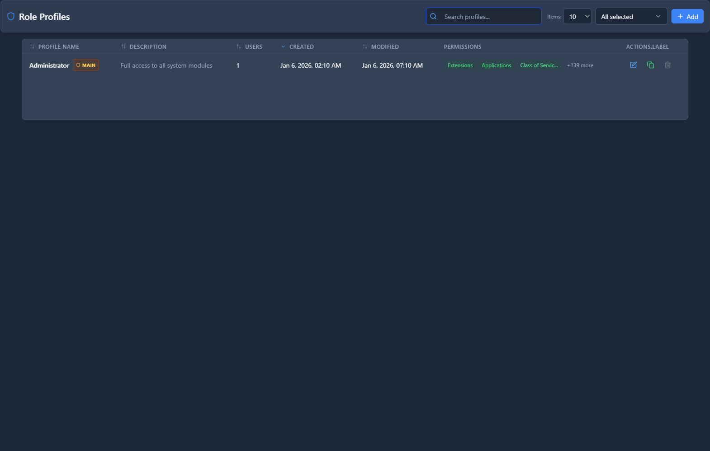

# Roles

## 📖 Introduction

Roles define permission sets that can be assigned to users. Create custom roles with specific access to different parts of the system.

---

## 🎯 Default Roles

| Role | Access Level |
|------|--------------|
| **Super Admin** | Everything |
| **Administrator** | All except system settings |
| **Operator** | Manage calls and users |
| **Support** | View and manage calls |
| **Viewer** | Read-only access |

---

## 🖥️ Accessing the Module

**Navigation:** `Admin → Users & Roles → Roles`

---

## 📝 Form Fields

| Field | Description | Example |
|-------|-------------|---------|
| **Name** | Role name | `Call Center Manager` |
| **Description** | Role purpose | `Manage queues and agents` |
| **Enabled** | Role is active | `Yes` |

### Permissions

Check permissions to grant:

| Category | Permissions |
|----------|-------------|
| **Extensions** | View, Create, Edit, Delete |
| **Queues** | View, Create, Edit, Delete |
| **Reports** | CDR, Statistics, Queue Reports |
| **Settings** | General, Email, Security |
| **Admin** | Users, Roles, Audit Log |

---

## 🚀 Practical Example

### Call Center Manager Role

Grant access to:
- ✅ View Extensions
- ✅ View/Edit Queues
- ✅ View/Edit Agents
- ✅ View Queue Reports
- ✅ View Active Calls
- ❌ System Settings
- ❌ User Management

---

## 💡 Tips

> [!TIP]
> **Principle of least privilege**: Grant only what's needed.

> [!TIP]
> **Create role per function**: Sales Manager, Support Lead, etc.

---

## 🔗 Related Modules

- [Users](users.md) — Assign roles to users
- [Audit Log](audit-log.md) — Track user actions

---

*← Previous: [Users](users.md) | Next: [Audit Log](audit-log.md) →*
