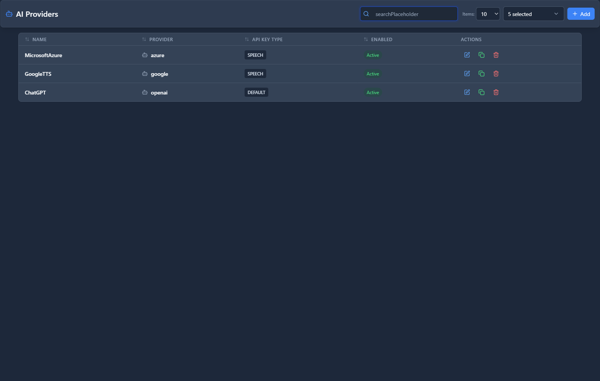

# AI Providers

## 📖 Introduction

AI Providers are the connections to AI services like OpenAI and Azure OpenAI. Before you can use AI Agents (voice assistants) or AI features like voicemail transcription, you must configure at least one AI Provider.

**Supported providers:**
- **OpenAI** — ChatGPT, Whisper (transcription), TTS
- **Azure OpenAI** — Microsoft-hosted OpenAI models
- **Google Cloud** — Text-to-speech services

---

## 🎯 Common Use Cases

| Use Case | Provider Feature |
|----------|-----------------|
| AI Voice Agents | OpenAI Realtime API |
| Voicemail transcription | OpenAI Whisper |
| Text-to-speech | OpenAI TTS or Google Cloud |
| Call summarization | GPT-4 |

---

## 🖥️ Accessing the Module

**Navigation:** `Admin → AI Integration → AI Providers`

---

## 📝 Form Fields

### OpenAI Provider

| Field | Description | Example |
|-------|-------------|---------|
| **Name** | Provider identifier | `OpenAI Production` |
| **Provider Type** | Select provider | `OpenAI` |
| **API Key** | Your OpenAI API key | `sk-proj-xxxx...` |
| **Organization ID** | OpenAI Org ID (optional) | `org-xxxx` |
| **Default** | Use as default provider | `Yes` |
| **Enabled** | Provider is active | `Yes` |

### Azure OpenAI Provider

| Field | Description | Example |
|-------|-------------|---------|
| **Name** | Provider identifier | `Azure OpenAI` |
| **Provider Type** | Select provider | `Azure OpenAI` |
| **Endpoint** | Azure endpoint URL | `https://mycompany.openai.azure.com` |
| **API Key** | Azure API key | `xxxxxxxx` |
| **Deployment Name** | Model deployment name | `gpt-4-realtime` |
| **API Version** | Azure API version | `2024-10-01-preview` |

---

## 🚀 Practical Example: Adding OpenAI Provider

### Step 1: Get Your API Key

1. Go to [platform.openai.com](https://platform.openai.com)
2. Navigate to API Keys
3. Create a new secret key
4. Copy the key (starts with `sk-proj-`)

### Step 2: Create the Provider

| Field | Value |
|-------|-------|
| Name | `OpenAI Production` |
| Provider Type | `OpenAI` |
| API Key | `sk-proj-your-key-here` |
| Default | `Yes` |
| Enabled | `Yes` |

### Step 3: Test

Save and verify status shows "Connected"

---

## 💡 Tips & Best Practices

> [!TIP]
> **Set usage limits**: Configure spending limits in your OpenAI dashboard.

> [!TIP]
> **Create separate keys**: Use different keys for development and production.

> [!WARNING]
> **Secure your API key**: Anyone with your key can use your AI credits.

> [!TIP]
> **Monitor usage**: Check OpenAI dashboard regularly for unexpected usage.

---

## ❓ Frequently Asked Questions

**Q: Which provider should I choose?**

A: OpenAI is recommended for most users. Azure OpenAI is better for enterprise compliance requirements or if you need to keep data within Azure.

---

**Q: How much does it cost?**

A: AI Agents use the OpenAI Realtime API. Check [OpenAI pricing](https://openai.com/pricing) for current rates.

---

## 🔗 Related Modules

- [AI Profiles](ai-profiles.md) — Configure AI settings
- [AI Agents](ai-agents.md) — Create voice AI assistants

---

*Next: [AI Profiles](ai-profiles.md) →*
