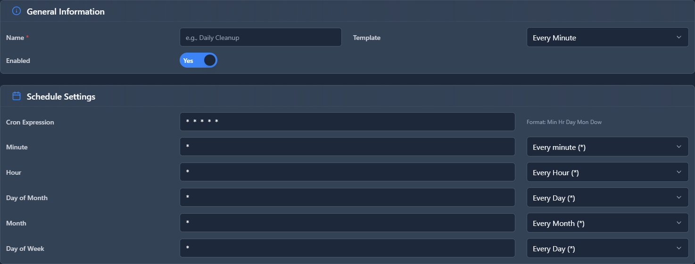

# Cron Profiles

## 📖 Introduction

Cron Profiles schedule automated tasks. Create backup schedules, cleanup jobs, and other periodic tasks.

---

## 🖥️ Accessing the Module

**Navigation:** `Admin → Maintenance → Cron Profiles`

---

## 📝 Form Fields

| Field | Description | Example |
|-------|-------------|---------|
| **Name** | Profile name | `Daily Backup` |
| **Schedule** | Cron expression | `0 2 * * *` |
| **Task** | What to run | `Backup` |
| **Enabled** | Profile is active | `Yes` |

### Common Schedules

| Schedule | Cron | Meaning |
|----------|------|---------|
| Every hour | `0 * * * *` | At minute 0 |
| Daily 2 AM | `0 2 * * *` | 2:00 AM daily |
| Weekly Sun | `0 3 * * 0` | Sunday 3 AM |
| Monthly 1st | `0 4 1 * *` | 1st day 4 AM |

---

## 🚀 Practical Example

### Nightly Backup at 2 AM

| Field | Value |
|-------|-------|
| Name | `Nightly Backup` |
| Schedule | `0 2 * * *` |
| Task | `Full Backup` |

---

## 💡 Tips

> [!TIP]
> **Off-peak hours**: Schedule heavy tasks at night.

> [!TIP]
> **Monitor execution**: Check logs for failures.

---

## 🔗 Related Modules

- [Backup & Restore](../11-administration/backup-restore.md) — Backup config
- [System Cleanup](system-cleanup.md) — Data retention
