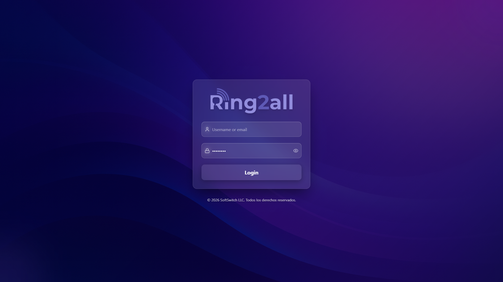

# User Portal Overview

## 📖 Introduction

The User Portal is a self-service web interface for end users. Employees can manage their phone settings, voicemail, call history, and more without contacting the administrator.

---

## 🎯 Portal Features

| Feature | Description |
|---------|-------------|
| **Dashboard** | Call status and quick actions |
| **Voicemail** | Listen and manage voicemails |
| **Call History** | View recent calls |
| **Recordings** | Access call recordings |
| **SMS** | Send and receive text messages |
| **Call Forwarding** | Configure where to forward calls |
| **Appearance** | BLF button assignments |
| **Settings** | Personal settings |

---

## 🔐 Accessing the Portal

**URL:** `https://your-pbx.com/portal`

### Login Credentials

| Option | Method |
|--------|--------|
| Extension + Password | Use extension number and voicemail PIN |
| Email + Password | If email login is enabled |
| SSO | Single sign-on if configured |

---

## 📱 Mobile Access

The portal is fully responsive and works on:
- Desktop browsers
- Tablets
- Mobile phones

---

## 💡 Tips

> [!TIP]
> **Bookmark the URL**: Quick access from any device.

> [!TIP]
> **Change password**: Update in Settings after first login.

---

## 🔗 Portal Modules

- [Dashboard](dashboard.md) — Overview and quick actions
- [Voicemail](voicemail.md) — Manage voicemails
- [Call History](call-history.md) — View call records
- [Recordings](recordings.md) — Call recordings
- [SMS](sms.md) — Text messaging
- [Call Forwarding](call-forwarding.md) — Forward settings
- [Appearance](appearance.md) — Phone buttons
- [Settings](settings.md) — Personal settings
