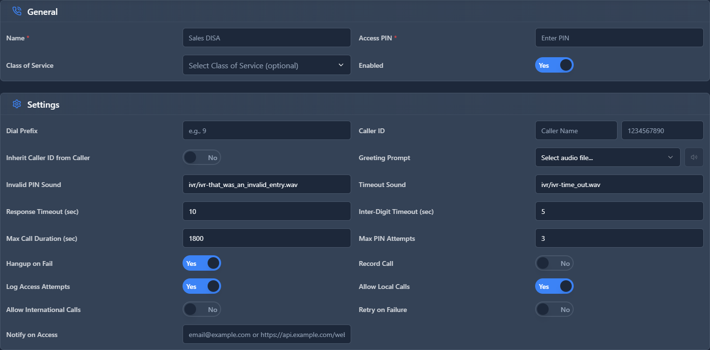

# DISA (Direct Inward System Access)

## 📖 Introduction

DISA allows users to dial into the phone system from an external phone and then make outbound calls as if they were in the office. The call appears to come from your office number.

**How it works:**
1. Call your DISA number from your cell phone
2. Enter your PIN
3. Dial any number as if you were at your desk
4. Caller ID shows your office number, not your cell

---

## 🎯 Common Use Cases

| Scenario | Benefit |
|----------|---------|
| Traveling executive | Call clients from office number |
| Remote worker | Use company trunks for long-distance |
| Mobile salesperson | Professional caller ID when on the road |

---

## 🖥️ Accessing the Module

**Navigation:** `PBX → Applications → DISA`

---

## 📝 Form Fields

| Field | Description | Example |
|-------|-------------|---------|
| **Name** | DISA line identifier | `Executive DISA` |
| **Extension** | Internal access number | `9999` |
| **Caller ID Verification** | Require calling from known number | `Yes` |
| **Allowed Numbers** | Caller IDs allowed (if verification on) | `+15551234567` |
| **PIN Required** | Require PIN entry | `Yes` |
| **PIN** | Access PIN | `123456` |
| **Context** | Dialplan context (usually default) | `default` |
| **Enabled** | DISA is active | `Yes` |

---

## 🚀 Practical Example: Executive DISA Access

### Step 1: Create DISA Entry

| Field | Value |
|-------|-------|
| Name | `CEO DISA` |
| Extension | `9999` |
| Caller ID Verification | `Yes` |
| Allowed Numbers | `+15558765432` (CEO's cell) |
| PIN Required | `Yes` |
| PIN | `654321` |

### Step 2: Create Inbound Route

Route a DID (e.g., +15559999999) to DISA extension 9999.

### Step 3: How to Use

1. CEO calls +1-555-999-9999 from her cell
2. System recognizes her cell number
3. She enters PIN 654321
4. She dials the client number
5. Client sees office caller ID

---

## 💡 Tips

> [!TIP]
> **Use Caller ID verification**: Adds security layer.

> [!WARNING]
> **DISA is a security risk**: If PIN is compromised, attackers can make calls on your account. Use strong PINs!

> [!TIP]
> **Link to Class of Service**: Limit what numbers DISA users can dial.

---

## 🔗 Related Modules

- [Inbound Routes](../03-pbx-routing/inbound-routes.md) — Route DID to DISA
- [Class of Services](../04-class-of-service/class-of-services.md) — Control DISA dialing permissions

---

*← Previous: [Direct Dial](direct-dial.md) | Next: [Custom Applications](custom-applications.md) →*
