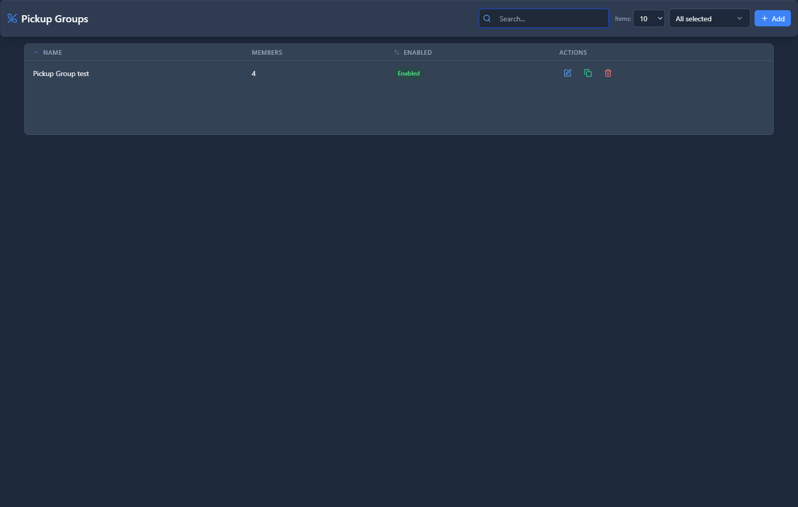

# Pickup Groups

## 📖 Introduction

Pickup Groups allow you to answer a ringing phone from your own desk. If a colleague's phone is ringing and they're away, you can dial a pickup code to answer their call.

**How it works:**
1. A phone in your pickup group rings
2. You dial the pickup code (e.g., `*8`)
3. The call is transferred to your phone
4. You're now connected to the caller

---

## 🎯 Common Use Cases

| Scenario | Pickup Group |
|----------|--------------|
| Nearby colleague away from desk | Pick up their call |
| Reception backup | Anyone can cover the front desk |
| Sales team support | Team members help each other |
| Executive assistants | Answer boss's line when needed |

---

## 🖥️ Accessing the Module

**Navigation:** `PBX → Applications → Pickup Groups`

---

## 📝 Form Fields

| Field | Description | Example |
|-------|-------------|---------|
| **Name** | Group identifier | `Sales Team` |
| **Pickup Code** | Feature code to pick up calls | `*8` |
| **Description** | Notes | `Sales department pickup` |
| **Enabled** | Group is active | `Yes` |

### Members

Add extensions that can pick up each other's calls:

| Extension | Name |
|-----------|------|
| `1010` | Alice (Sales) |
| `1011` | Bob (Sales) |
| `1012` | Carol (Sales) |
| `1013` | David (Sales) |

---

## 🚀 Practical Example: Sales Team Pickup

### Scenario

Allow sales team members to answer each other's phones.

### Step 1: Create the Pickup Group

| Field | Value |
|-------|-------|
| Name | `Sales Team Pickup` |

### Step 2: Add Sales Team Extensions

Add extensions 1010, 1011, 1012, 1013.

### Step 3: How to Use

When Alice (1010) is ringing and Bob (1011) wants to answer:
1. Bob picks up his phone
2. Bob dials `*8`
3. Bob is now connected to Alice's caller

---

## 💡 Tips & Best Practices

> [!TIP]
> **Group by physical proximity**: People nearby should be in the same group.

> [!TIP]
> **Group by team**: Natural backup within teams.

> [!TIP]
> **Use BLF**: Configure BLF buttons to see who's ringing before picking up.

---

## 🔗 Related Modules

- [Extensions](../01-pbx-extensions/extensions.md) — BLF supervision for monitoring
- [Feature Codes](feature-codes.md) — Configure pickup code

---

*← Previous: [Paging Groups](paging-groups.md) | Next: [Speed Dials](speed-dials.md) →*
