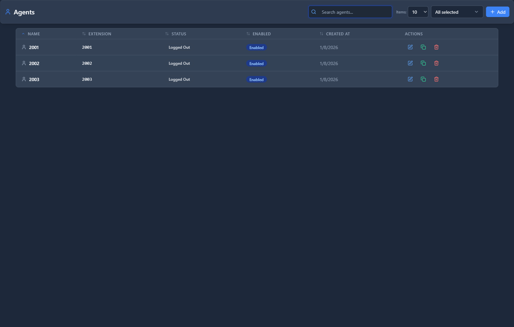

# Agents

## 📖 Introduction

Agents are extensions that can receive queue calls. Each agent has a status (available, on break, logged out) and can be assigned to multiple queues.

---

## 🎯 Common Use Cases

| Agent Type | Queues Assigned |
|------------|-----------------|
| General Support | Support, Billing |
| Sales Rep | Sales |
| Tier 2 Support | Support-Escalation |
| Receptionist | Main, Support, Sales |

---

## 🖥️ Accessing the Module

**Navigation:** `PBX → Call Center → Agents`

---

## 📝 Form Fields

| Field | Description | Example |
|-------|-------------|---------|
| **Name** | Agent display name | `John Smith` |
| **Extension** | Associated extension | `1001` |
| **Contact** | How to reach agent | `user/1001` |
| **Max No Answer** | Missed calls before paused | `3` |
| **Wrap Up Time** | Seconds after call | `10` |
| **Status** | Current availability | `Available` |
| **Enabled** | Agent is active | `Yes` |

### Agent Statuses

| Status | Meaning |
|--------|---------|
| **Available** | Ready to receive calls |
| **On Break** | Temporarily unavailable |
| **Logged Out** | Not receiving calls |
| **Busy** | Currently on a call |

### Queue Membership

Assign agent to one or more queues:

| Queue | Tier | Level |
|-------|------|-------|
| Support Queue | 1 | 1 |
| Sales Queue | 1 | 2 |
| Billing Queue | 2 | 1 |

- **Tier**: Agents in lower tiers receive calls first
- **Level**: Priority within the tier

---

## 🚀 Practical Example

### Create Support Agent

| Field | Value |
|-------|-------|
| Name | `Jane Doe` |
| Extension | `1002` |
| Max No Answer | `3` |
| Wrap Up Time | `15` |

**Queue Assignments:**
- Support Queue: Tier 1, Level 1
- Sales Queue: Tier 2, Level 1 (backup)

---

## 💡 Tips

> [!TIP]
> **Use tiers for escalation**: Tier 1 = primary agents, Tier 2 = backup.

> [!TIP]
> **Set reasonable wrap-up time**: 10-30 seconds for note-taking.

---

## 🔗 Related Modules

- [Queues](queues.md) — Where agents receive calls
- [Extensions](../01-pbx-extensions/extensions.md) — Agent phone settings

---

*← Previous: [Queues](queues.md) | Next: [Priority Routing](priority-routing.md) →*
