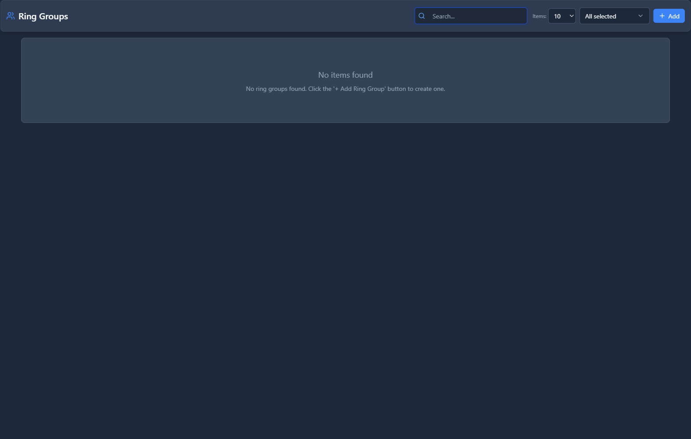

# Ring Groups

## 📖 Introduction

A Ring Group allows you to ring multiple extensions at once when a call comes in. This ensures calls are answered quickly, even if some team members are busy.

**How it works:**
- A call arrives at the ring group
- Multiple phones ring (simultaneously or in sequence)
- The first person to pick up gets the call
- Others stop ringing

---

## 🎯 Common Use Cases

| Scenario | Ring Strategy |
|----------|---------------|
| Sales team - anyone available answers | Simultaneous |
| Support escalation - try agents in order | Sequential |
| Executive backup - ring main phone, then assistant | Sequential with delay |
| Small office - all phones ring | Simultaneous |

---

## 📋 Prerequisites

- [ ] Extensions created for group members
- [ ] Decide on ring strategy (simultaneous vs sequential)

---

## 🖥️ Accessing the Module

**Navigation:** `PBX → Applications → Ring Groups`

---

## 📝 Form Fields

### General Tab

<!-- [IMG: ring-groups-form-general-tab] -->

| Field | Description | Example |
|-------|-------------|---------|
| **Name** | Identifier for this ring group | `Sales Team` |
| **Extension** | Number to dial to reach this group | `6001` |
| **Description** | Notes about this group | `Front-line sales team` |
| **Enabled** | Turn group on/off | `Yes` |

### Ring Settings Tab

<!-- [IMG: ring-groups-form-ring-settings-tab] -->

| Field | Description | Example |
|-------|-------------|---------|
| **Ring Strategy** | How phones ring (see below) | `Simultaneous` |
| **Ring Timeout** | Total seconds before no-answer action | `30` |
| **Skip Busy Members** | Don't ring members already on calls | `Yes` |
| **Ring Back Tone** | What caller hears while ringing | `Ring` |
| **Introductory Greeting** | Audio to play before ringing starts | `(none)` |

#### Ring Strategies

| Strategy | Description |
|----------|-------------|
| **Simultaneous** | All phones ring at the same time |
| **Sequential** | Phones ring one at a time, in order |
| **Random** | Phones ring one at a time, random order |
| **Rollover** | Like sequential, but remembers who answered last |
| **Longest Idle** | Rings the person who hasn't taken a call longest |

### Members Tab

<!-- [IMG: ring-groups-form-members-tab] -->

Add extensions to the ring group:

| Extension | Name | Delay | Timeout |
|-----------|------|-------|---------|
| `1001` | John Smith | 0 | 30 |
| `1002` | Jane Doe | 0 | 30 |
| `1003` | Bob Wilson | 5 | 25 |

- **Delay**: Seconds before this phone starts ringing (useful for sequential/tiered)
- **Timeout**: How long this specific phone rings

### No Answer Tab

<!-- [IMG: ring-groups-form-no-answer-tab] -->

| Field | Description | Example |
|-------|-------------|---------|
| **No Answer Destination** | Where to route if nobody answers | `Voicemail: Sales` |
| **Timeout Action** | What happens when timeout expires | `Go to destination` |

---

## 🚀 Practical Example: Sales Team Ring Group

### Scenario

Create a ring group for the sales team where:
- All 4 sales reps ring simultaneously
- After 30 seconds, goes to sales voicemail
- Busy members are skipped

### Step 1: Create the Ring Group

Go to **PBX → Applications → Ring Groups** and click **+ Add**.

### Step 2: Configure General Settings

| Field | Value |
|-------|-------|
| Name | `Sales Team` |
| Extension | `6001` |

### Step 3: Configure Ring Settings

| Field | Value |
|-------|-------|
| Ring Strategy | `Simultaneous` |
| Ring Timeout | `30` |
| Skip Busy Members | `Yes` |

<!-- [IMG: example-ring-group-settings] -->

### Step 4: Add Members

| Extension | Name | Delay | Timeout |
|-----------|------|-------|---------|
| `1010` | Alice Johnson | 0 | 30 |
| `1011` | Bob Williams | 0 | 30 |
| `1012` | Carol Davis | 0 | 30 |
| `1013` | David Brown | 0 | 30 |

<!-- [IMG: example-ring-group-members] -->

### Step 5: Configure No Answer

| Field | Value |
|-------|-------|
| No Answer Destination | `Voicemail: sales@company.com` |

### Step 6: Save and Test

1. Click **Save**
2. Dial `6001` from another extension
3. Verify all 4 phones ring
4. Let it timeout and verify voicemail answers

---

## 💡 Tips & Best Practices

> [!TIP]
> **Simultaneous is usually best**: It gets calls answered fastest.

> [!TIP]
> **Skip busy members**: Prevents calls from being missed due to engaged lines.

> [!TIP]
> **Use tiered delays**: For example, ring main people for 15s, then add backup people.

> [!WARNING]
> **Watch timeout totals**: In sequential mode, total timeout equals sum of all member timeouts.

> [!TIP]
> **Test with busy members**: Make sure calls don't get stuck when people are on calls.

---

## ❓ Frequently Asked Questions

**Q: What's the difference between Ring Groups and Queues?**

A: Ring Groups are simpler - they just ring phones. Queues add features like hold music, position announcements, callbacks, and agent availability tracking.

---

**Q: Can I add external numbers to a ring group?**

A: Yes! You can add external numbers or mobile phones as members.

---

**Q: Why aren't all phones ringing?**

A: Check:
1. Members are enabled in the list
2. Skip Busy Members isn't excluding them
3. Extensions are registered (check Extension Status)

---

## 🔗 Related Modules

- [Extensions](../01-pbx-extensions/extensions.md) — Create members for the group
- [Queues](../05-call-center/queues.md) — Advanced call distribution
- [IVRs](ivrs.md) — Route IVR options to ring groups
- [Time Conditions](../03-pbx-routing/time-conditions.md) — Change ring group by time

---

*← Previous: [IVRs](ivrs.md) | Next: [Announcements](announcements.md) →*
