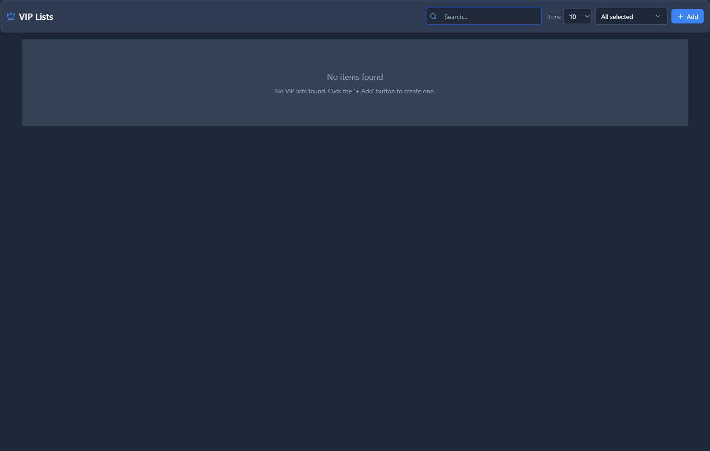
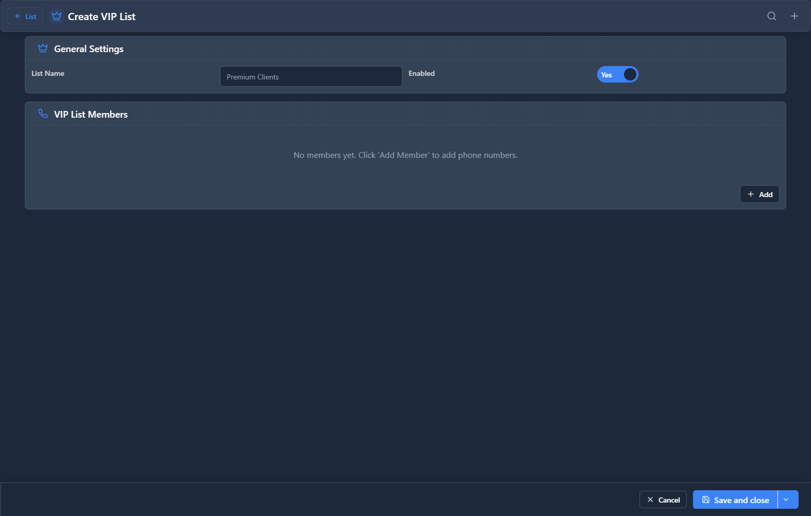

# VIP Lists

## 📖 Introduction

VIP Lists are collections of caller IDs that receive special treatment. Use them with Priority Routing to identify important callers.

---

## 🎯 Common Use Cases

| VIP List | Contains |
|----------|----------|
| Enterprise Customers | Major account phone numbers |
| Board Members | Executive contacts |
| Key Partners | Strategic partners |
| Press/Media | Journalist contacts |

---

## 🖥️ Accessing the Module

**Navigation:** `PBX → Call Center → VIP Lists`

---

## 📝 Form Fields

| Field | Description | Example |
|-------|-------------|---------|
| **Name** | List identifier | `Enterprise Customers` |
| **Description** | Notes | `Fortune 500 accounts` |
| **Enabled** | List is active | `Yes` |

### VIP Entries

| Caller ID | Name | Notes |
|-----------|------|-------|
| `+15551234567` | Acme Corp Main | Primary contact |
| `+15559876543` | Widget Inc | CEO direct line |
| `+15552468135` | Tech Solutions | Support manager |

---

## 🚀 Practical Example

### Create Enterprise VIP List

1. Create the list with name `Enterprise Customers`
2. Add caller IDs of your top accounts
3. Link to Priority Routing rule

---

## 💡 Tips

> [!TIP]
> **Include multiple numbers**: Key contacts often call from different phones.

> [!TIP]
> **Review periodically**: Update as accounts change.

---

## 🔗 Related Modules

- [Priority Routing](priority-routing.md) — Use VIP lists for routing
- [Blacklist](../06-incoming-tools/blacklist.md) — Opposite: block callers

---

*← Previous: [Priority Routing](priority-routing.md) | Next: [Callback Rules](callback-rules.md) →*
