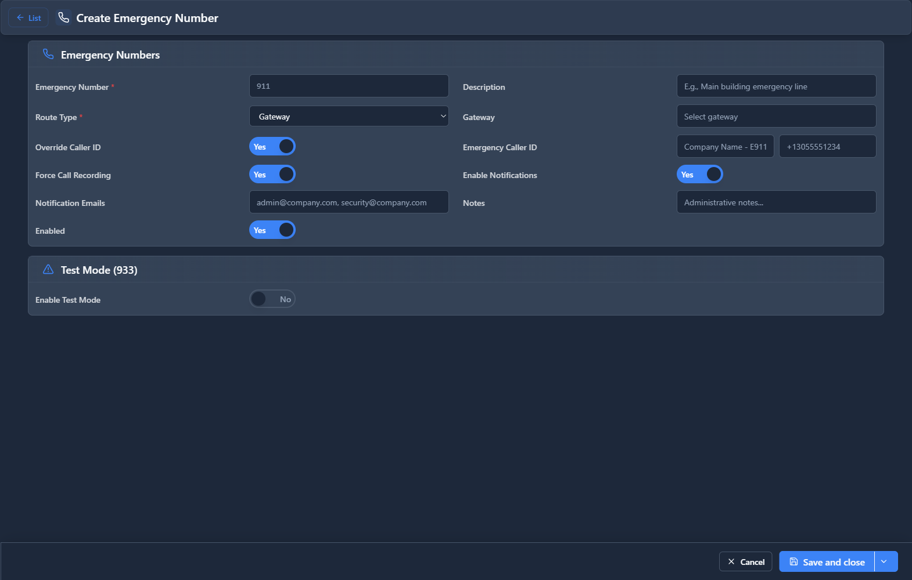

# Emergency Numbers

## 📖 Introduction

Emergency Numbers configuration ensures 911 (and other emergency services) work correctly with your phone system. This is critical for safety compliance.

---

## 🎯 E911 Compliance

E911 (Enhanced 911) sends your location to emergency responders. You must configure:
- Correct caller ID for 911 calls
- Physical location (dispatch address) for each building
- Priority routing that bypasses normal restrictions

---

## 🖥️ Accessing the Module

**Navigation:** `PBX → Incoming Tools → Emergency Numbers`

---

## 📝 Form Fields

### Emergency Numbers

| Field | Description | Example |
|-------|-------------|---------|
| **Number** | Emergency number | `911` |
| **Priority** | Outbound priority | `1 (highest)` |
| **Gateway** | Trunk for emergency calls | `PSTN Primary` |
| **Caller ID Override** | Force specific caller ID | `+15551234567` |
| **Location** | Dispatch location | `123 Main St` |
| **Enabled** | Routing is active | `Yes` |

### Dispatch Locations

| Field | Description | Example |
|-------|-------------|---------|
| **Name** | Location identifier | `Main Office` |
| **Address** | Street address | `123 Main Street` |
| **City** | City | `New York` |
| **State** | State | `NY` |
| **ZIP** | Postal code | `10001` |
| **Extensions** | Extensions at this location | `1001-1099` |

---

## 🚀 Practical Example

### Configure Multi-Building E911

If your company has offices at two addresses:

**Location 1: Headquarters**
- Extensions 1000-1499
- Address: 123 Main St, New York, NY

**Location 2: Warehouse**
- Extensions 1500-1999
- Address: 456 Industrial Ave, Brooklyn, NY

Configure so 911 calls from each location send the correct address.

---

## ⚠️ Critical Requirements

> [!CAUTION]
> **Test 911 routing**: But notify local PSAP first. Many jurisdictions have non-emergency test numbers.

> [!CAUTION]
> **Update addresses**: When you move offices, update emergency addresses immediately.

> [!WARNING]
> **Remote workers**: VoIP 911 may send wrong location for home workers. Consider cellular backup.

> [!CAUTION]
> **Never block 911**: Class of Service must always allow emergency calls.

---

## 🔗 Related Modules

- [Outbound Routes](../03-pbx-routing/outbound-routes.md) — Emergency route configuration
- [Class of Services](../04-class-of-service/class-of-services.md) — Emergency permissions

---

*← Previous: [Reminder Calls](reminder-calls.md)*
