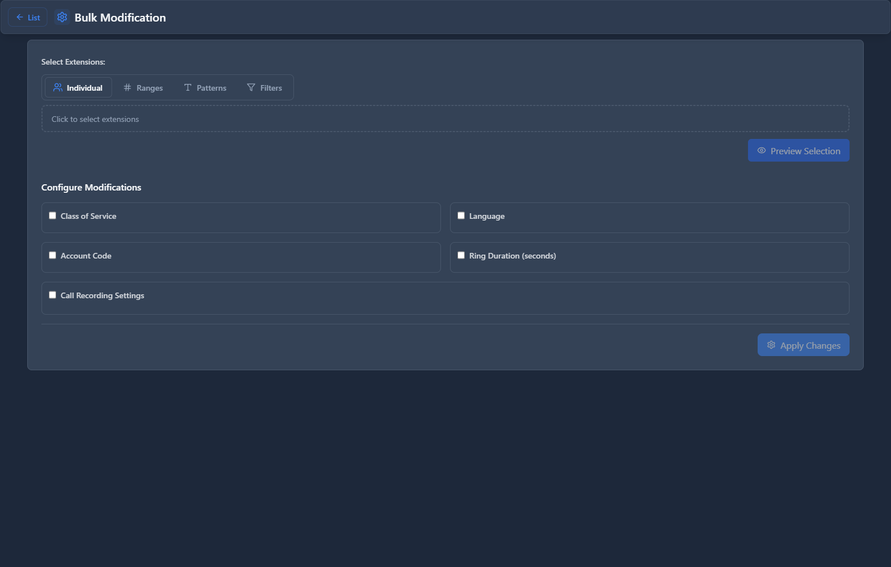

# Bulk Modification

## 📖 Introduction

Bulk Modification allows you to change settings on multiple extensions at once. Instead of editing each extension individually, you can select many and apply changes in one operation.

**What you can do:**
- Enable/disable voicemail for many extensions at once
- Change the Class of Service for a department
- Update recording settings across the organization
- Enable/disable extensions in bulk

---

## 🎯 Common Use Cases

| Scenario | What to Do |
|----------|------------|
| New policy: record all calls | Enable recording for all extensions |
| Department reorganization | Change Class of Service for a group |
| Seasonal shutdown | Disable extensions temporarily |
| Upgrade voicemail settings | Enable transcription for all users |

---

## 🖥️ Accessing the Module

**Navigation:** `PBX → Extensions → Bulk Modification`

---

## 📝 How It Works

<!-- [IMG: bulk-modification-main-view] -->

### Step 1: Select Extensions

Choose which extensions to modify:

| Method | Description |
|--------|-------------|
| **Select All** | Apply to every extension |
| **Search & Select** | Filter by name, number, or department |
| **Manual Selection** | Check individual boxes |

### Step 2: Choose Fields to Modify

Select which settings you want to change:

| Field Category | Examples |
|---------------|----------|
| **Basic** | Enabled, Voicemail Enabled, BLF Supervision |
| **Class of Service** | Assign a different permission profile |
| **Recording** | Enable/disable call recording |
| **Voicemail** | Email notifications, transcription |
| **Advanced** | Ring timeout, max concurrent calls |

### Step 3: Set New Values

Enter the new value for each selected field.

### Step 4: Apply Changes

Click **Apply** to update all selected extensions.

---

## 🚀 Practical Example: Enable Recording for All Sales

### Scenario

Management requires all Sales department calls to be recorded.

### Step 1: Filter Extensions

In Bulk Modification, search for extensions in the 1000-1099 range (Sales department).

<!-- [IMG: example-bulk-filter-sales] -->

### Step 2: Select All Results

Click **Select All** to choose all filtered extensions.

### Step 3: Enable Recording

1. Check **Record Incoming**
2. Check **Record Outgoing**
3. Set both to **Yes**

<!-- [IMG: example-bulk-enable-recording] -->

### Step 4: Apply

Click **Apply Changes**.

### Result

All 25 Sales extensions now have call recording enabled.

---

## 💡 Tips & Best Practices

> [!TIP]
> **Preview before applying**: Review the selected extensions and changes before clicking Apply.

> [!WARNING]
> **Changes are immediate**: Bulk changes take effect instantly and cannot be undone automatically.

> [!TIP]
> **Use filters wisely**: Filter by Class of Service, extension range, or enabled status to target specific groups.

---

## 🔗 Related Modules

- [Extensions](extensions.md) — Edit individual extensions
- [Class of Services](../04-class-of-service/class-of-services.md) — Permission profiles

---

*← Previous: [Extension Status](extension-status.md) | Next: [Hot Desking](hot-desking.md) →*
