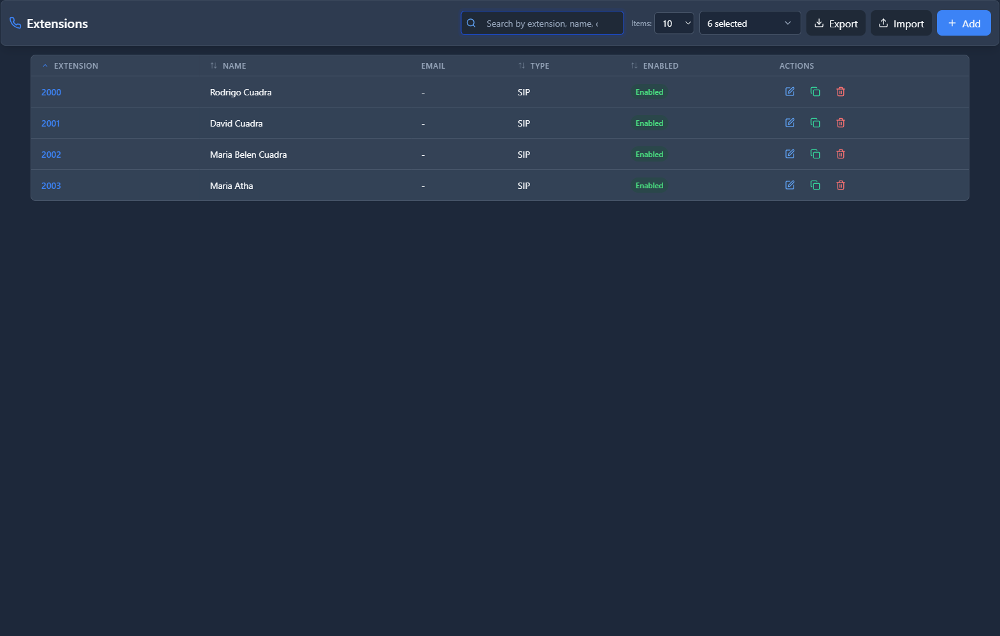

# Extensions

## 📖 Introduction

Extensions are the core of your phone system. Each extension represents a phone number within your organization that an employee uses to make and receive calls.

Think of an extension like a mailbox — it has a unique number, can receive calls and messages, and can be configured to forward calls when the user is busy or unavailable.

**What you can do with extensions:**
- Assign phone numbers (like 1001, 1002, etc.) to employees
- Configure voicemail for each user
- Set up call forwarding when busy or unavailable
- Enable call recording for compliance or training
- Create a personal assistant menu to screen calls
- Allow users to access their phone from multiple devices

---

## 🎯 Common Use Cases

| Scenario | What to Configure |
|----------|-------------------|
| New employee joining | Create a new extension |
| Employee leaving | Disable or delete the extension |
| User needs voicemail | Enable voicemail in extension settings |
| User travels frequently | Configure Follow Me to ring their mobile |
| Executive needs call screening | Enable Personal Assistant |
| Recording for compliance | Enable call recording |

---

## 📋 Prerequisites

Before creating an extension, ensure you have:

- [ ] A **Class of Service** created (controls what calls users can make)
- [ ] **Voicemail settings** configured (if voicemail will be used)
- [ ] A **numbering plan** decided (e.g., 1000-1999 for sales, 2000-2999 for support)

---

## 🖥️ Accessing the Module

**Navigation:** `PBX → Extensions → Extensions`

The list view shows all extensions in your domain. You can:
- Click **+ Add** to create a new extension
- Click any row to edit an existing extension
- Use the search bar to find extensions by number, name, or email
- Use bulk actions for mass operations

---

## 📝 Form Fields

### General Tab

| Field | Description | Example |
|-------|-------------|---------|
| **Extension Number** | The unique phone number for this user within your system. Cannot be changed after creation. | `1001` |
| **Name** | Full name of the person using this extension. Appears in call logs and caller ID. | `John Smith` |
| **Email Address** | Used for voicemail notifications and password recovery. | `john.smith@company.com` |
| **Extension Type** | **SIP** = Normal phone. **Virtual** = Forward-only (no device). **None** = Shared phone (hot desking). | `SIP` |
| **Class of Service** | Controls what calls this user can make (local, long-distance, international). | `Standard` |
| **Agent Profile** | If this user is a call center agent, select their profile. | `Support Agent` |
| **Language** | Language for voicemail prompts and system messages. | `English (US) - Emma` |
| **Features Password** | A PIN required to access features like voicemail from another phone. | `7738` |
| **Enabled** | Turn off to temporarily disable without deleting. | `Yes` |
| **Voicemail Enabled** | Quick toggle to enable/disable voicemail. | `Yes` |
| **BLF Supervision** | Allow other phones to monitor when this extension is on a call. | `Yes` |
| **SMS Number** | Assign an SMS-enabled number for text messaging (appears in User Portal). | `+15551234567` |

#### SIP Device Settings

| Field | Description | Example |
|-------|-------------|---------|
| **SIP Username** | Username the phone uses to register. Usually matches extension number. | `1001` |
| **SIP Password** | Password the phone uses to connect. **Keep secure!** Max 15 characters. | `Xk9#mP2$vL7n` |
| **SIP Profile** | Network configuration for the device. Default is usually correct. | `Internal` |
| **DTMF Type** | How the phone sends touch-tone digits. RFC 2833 recommended. | `RFC 2833` |
| **Max Contacts** | How many devices can register at once (desk phone + mobile + web). | `5` |

#### Portal Access

| Field | Description | Example |
|-------|-------------|---------|
| **Enable Portal** | Allow user to access the self-service web portal. | `Yes` |
| **Portal User** | Username for portal login. Leave blank to use extension number. | `1001` |
| **Portal Password** | Password for portal login. Separate from SIP password for security. | `SecurePass123` |

---

### Voicemail Tab

| Field | Description | Example |
|-------|-------------|---------|
| **Voicemail PIN** | PIN to access voicemail from any phone. | `1234` |
| **Notification Email** | Email where voicemail notifications are sent. | `user@company.com` |
| **Max Messages** | Maximum voicemails to keep. Oldest deleted when limit reached. | `100` |
| **Notify by Email** | Send email when new voicemail received. | `Yes` |
| **Attach Audio** | Include recording as email attachment. | `Yes` |
| **Transcribe Messages** | Convert voicemail to text (requires AI integration). | `No` |
| **Prompt Language** | Language for "Press 1 to save..." prompts. | `English` |
| **Timezone** | For accurate message timestamps. | `America/New_York` |
| **Custom Greeting** | Your own recorded greeting message. | `greeting.wav` |

---

### Recording Tab

| Field | Description | Example |
|-------|-------------|---------|
| **Record Incoming** | Auto-record all calls TO this extension. | `Yes` |
| **Record Outgoing** | Auto-record all calls FROM this extension. | `Yes` |
| **Record Internal** | Record calls between extensions. Usually off to save storage. | `No` |
| **On-Demand Recording** | Allow user to start/stop recording mid-call with `*1`. | `Yes` |
| **Audio Format** | File format. WAV = best quality. MP3 = saves 90% storage. | `WAV` |

> [!WARNING]
> **Recording Consent**: Many jurisdictions require consent for call recording. Configure appropriate announcements and ensure compliance with local laws.

---

### Advanced Tab

| Field | Description | Example |
|-------|-------------|---------|
| **Ring Timeout** | How long phone rings before voicemail/forwarding (seconds). | `25` |
| **Max Concurrent Calls** | How many calls at once. Set to 1 to force one-call-at-a-time. | `5` |
| **Call Waiting** | Allow receiving second call while on another. | `Yes` |
| **Reject Anonymous** | Block calls from hidden numbers. | `No` |
| **Auto Answer** | Phone auto-answers (for paging systems). ⚠️ Privacy risk! | `No` |
| **Music on Hold** | Audio played when caller is on hold. | `default` |
| **Caller ID Privacy** | Hide your caller ID when calling out. | `None` |
| **Call Screening** | Ask callers to say their name before connecting. | `No` |

#### Caller ID Override

| Field | Description | Example |
|-------|-------------|---------|
| **Caller ID Name** | Name shown when calling internally. | `John Smith` |
| **Caller ID Number** | Number shown when calling internally. | `1001` |
| **Outbound Caller ID Name** | Name shown to external parties. | `Acme Corp` |
| **Outbound Caller ID Number** | Number shown externally. Should be your company's DID. | `+15551234567` |

---

### Forwardings Tab

| Field | Description | When It Activates |
|-------|-------------|-------------------|
| **Call Forward (Always)** | Forward ALL calls immediately without ringing. | All the time |
| **On Busy** | Forward when already on a call. | User is on another call |
| **No Answer** | Forward after ring timeout. | Ring timeout expires |
| **Not Registered** | Forward when phone is offline. | Device disconnected |
| **Do Not Disturb** | Block all calls (busy tone or voicemail). | DND enabled |

> [!TIP]
> When forwarding is enabled, it takes priority over voicemail for that condition.

---

### Follow Me Tab

Follow Me rings multiple devices when someone calls your extension.

| Field | Description | Example |
|-------|-------------|---------|
| **Enable Follow Me** | Turn on multi-device ringing. | `Yes` |
| **Ignore Busy** | Keep trying other phones if one is busy. | `Yes` |
| **Ring Strategy** | **Simultaneous** = all ring together. **Sequential** = one after another. | `Simultaneous` |

#### Follow Me Destinations

Add multiple phone numbers to ring:

| Destination | Delay | Timeout | Notes |
|-------------|-------|---------|-------|
| `+15559876543` | 0 | 20 | Mobile rings immediately |
| `1002` | 5 | 15 | Assistant rings after 5 seconds |

---

### Personal Assistant Tab

Create a mini-menu for your extension that greets callers before ringing your phone.

| Field | Description | Example |
|-------|-------------|---------|
| **Enable Personal Assistant** | Turn on the greeting menu. | `Yes` |
| **Welcome Message Type** | **None**, **Custom** (upload audio), or **TTS** (text-to-speech). | `TTS` |
| **Welcome Message Text** | What to say if using TTS. | `Press 1 for mobile, 2 for assistant, or hold for voicemail.` |
| **Input Timeout** | How long to wait for caller to press a digit. | `10` seconds |
| **Max Retries** | How many times to replay if wrong button pressed. | `3` |
| **If No Input** | What to do if no digit pressed. | `Voicemail` |

#### Digit Options

| Digit | Destination | Example |
|-------|-------------|---------|
| `1` | Mobile | `+15559876543` |
| `2` | Extension (Assistant) | `1002` |

---

### Contact Tab

Administrative information about the extension owner.

| Field | Description | Example |
|-------|-------------|---------|
| **Contact Name** | Full name for directory. | `John Smith` |
| **Contact Email** | Additional email for records. | `jsmith@personal.com` |
| **Contact Phone** | Mobile or alternate number. | `+15559876543` |
| **Notes** | Internal notes (visible to admins only). | `Remote worker, PST timezone` |

---

## 🚀 Practical Example: Creating an Office Extension

### Scenario

A new employee, **Sarah Johnson**, joins the Sales department. She needs:
- Extension 1050 with voicemail
- Ability to make local and long-distance calls
- Call recording for training purposes
- Forwarding to voicemail if no answer

### Step 1: Navigate to Extensions

Go to **PBX → Extensions → Extensions** and click **+ Add**.

### Step 2: Configure General Tab

Fill in the basic information:

| Field | Value |
|-------|-------|
| Extension Number | `1050` |
| Name | `Sarah Johnson` |
| Email | `sarah.johnson@company.com` |
| Extension Type | `SIP` |
| Class of Service | `Standard (Long Distance)` |
| Voicemail Enabled | `Yes` |

### Step 3: Configure Voicemail Tab

Set up voicemail:

| Field | Value |
|-------|-------|
| Voicemail PIN | `2468` |
| Notification Email | `sarah.johnson@company.com` |
| Notify by Email | `Yes` |
| Attach Audio | `Yes` |

### Step 4: Configure Recording Tab

Enable call recording:

| Field | Value |
|-------|-------|
| Record Incoming | `Yes` |
| Record Outgoing | `Yes` |
| On-Demand Recording | `Yes` |
| Audio Format | `MP3` |

### Step 5: Configure Advanced Tab

Set ring timeout:

| Field | Value |
|-------|-------|
| Ring Timeout | `25` |
| Call Waiting | `Yes` |

### Step 6: Save the Extension

Click **Save** at the bottom of the form.

### Result

- Sarah's extension 1050 is ready
- She can receive calls and voicemail
- All calls are recorded for training
- After 25 seconds of ringing, calls go to voicemail

### Provide SIP Credentials to User

Give Sarah her phone credentials:
- **Username**: `1050`
- **Password**: (from SIP Password field)
- **Server**: `pbx.yourcompany.com`

---

## 💡 Tips & Best Practices

> [!TIP]
> **Use meaningful extension numbers**: Assign 1xxx to Sales, 2xxx to Support, 3xxx to Engineering, etc.

> [!TIP]
> **Enable voicemail by default**: Most users expect voicemail. Enable it unless there's a specific reason not to.

> [!TIP]
> **Set Max Contacts to 5**: This allows users to register their desk phone, mobile app, and web client simultaneously.

> [!TIP]
> **Use MP3 for recordings**: Saves 90% storage compared to WAV with minimal quality loss.

> [!WARNING]
> **Never share SIP passwords**: SIP credentials grant full calling ability and could be abused.

> [!WARNING]
> **Test forwarding numbers**: Always verify that forwarding destinations work before relying on them.

---

## ❓ Frequently Asked Questions

**Q: Can I change an extension number after creating it?**

A: No, extension numbers cannot be changed. You would need to create a new extension and delete the old one. Consider this when planning your numbering scheme.

---

**Q: Why isn't my phone registering?**

A: Check these items:
1. SIP username and password are correct
2. Server address is correct
3. SIP profile matches your network configuration
4. Extension is enabled

---

**Q: How do I reset a user's voicemail PIN?**

A: Edit the extension, go to the Voicemail tab, and enter a new PIN in the "Voicemail PIN" field.

---

**Q: Can users change their own settings?**

A: Yes, if Portal Access is enabled. Users can log into the User Portal to change their voicemail settings, forwarding, and password.

---

**Q: Why are my recordings not being saved?**

A: Check:
1. Recording is enabled in the Recording tab
2. Storage path is accessible and has space
3. Audio format is configured

---

## 🔗 Related Modules

- [Class of Services](../04-class-of-service/class-of-services.md) — Controls calling permissions
- [Voicemail Settings](../08-voicemail-audio/voicemail-settings.md) — System-wide voicemail configuration
- [Ring Groups](../02-pbx-applications/ring-groups.md) — Make extensions ring together
- [Queues](../05-call-center/queues.md) — Call center functionality
- [Hot Desking](hot-desking.md) — Shared phone profiles

---

*Next: [Extension Status](extension-status.md) →*
