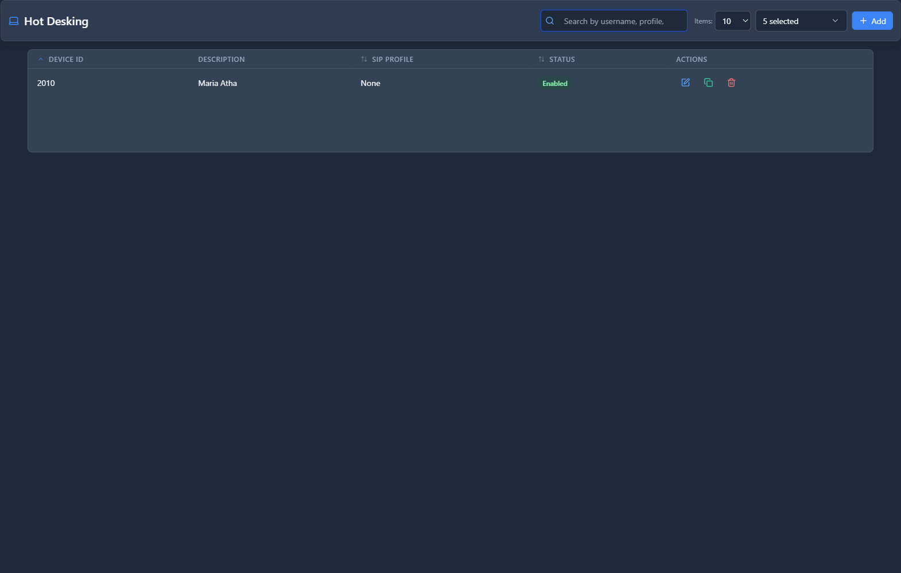

# Hot Desking

## 📖 Introduction

Hot Desking allows users to log into any phone in your organization with their personal extension. This is perfect for shared workspaces, flexible seating, or employees who move between locations.

**How it works:**
1. Phones are configured as "hot desk" devices without a permanent user
2. Employees dial a login code and enter their extension and PIN
3. The phone becomes that user's extension until they log out
4. When logged out, the phone returns to its idle state

---

## 🎯 Common Use Cases

| Scenario | Solution |
|----------|----------|
| Open office with shared desks | Employees log in when they arrive |
| Multiple shifts using same phones | Each shift logs in with their extensions |
| Traveling employees visiting offices | Use any available hot desk phone |
| Conference rooms | Temporary login for meeting calls |

---

## 📋 Prerequisites

- [ ] Extensions created with **Type = None** (hot desk mode)
- [ ] Feature codes configured for login/logout
- [ ] Phones provisioned as hot desk devices

---

## 🖥️ Accessing the Module

**Navigation:** `PBX → Extensions → Hot Desking`

---

## 📝 Form Fields

### Hot Desk Device Settings

| Field | Description | Example |
|-------|-------------|---------|
| **Device Name** | Identifier for this hot desk phone | `Lobby Phone 1` |
| **MAC Address** | Phone's hardware identifier | `00:11:22:33:44:55` |
| **Location** | Physical location description | `Building A, Floor 2` |
| **SIP Profile** | Network configuration for the device | `Internal` |
| **Login Code** | Feature code to log in (e.g., `*11`) | `*11` |
| **Logout Code** | Feature code to log out (e.g., `*12`) | `*12` |
| **Idle Timeout** | Auto-logout after inactivity (hours) | `8` |
| **Enabled** | Device is active and available | `Yes` |

---

## 🚀 Practical Example: Setting Up Hot Desk Phones

### Scenario

Your company has 10 shared desks in an open workspace. Employees should be able to use any phone.

### Step 1: Create Extensions with Type "None"

Go to **PBX → Extensions → Extensions** and create extensions for each employee:

| Field | Value |
|-------|-------|
| Extension Type | `None` |
| Name | `John Smith` |
| Features Password | `7738` |

<!-- [IMG: example-extension-type-none] -->

### Step 2: Configure Hot Desk Devices

Go to **PBX → Extensions → Hot Desking** and add each shared phone:

| Field | Value |
|-------|-------|
| Device Name | `Open Desk 1` |
| MAC Address | `00:11:22:33:44:55` |
| Location | `Open Workspace` |
| Login Code | `*11` |
| Logout Code | `*12` |

<!-- [IMG: example-hot-desk-device] -->

### Step 3: Provision the Phones

Configure each physical phone with:
- Server address
- Hot desk device credentials
- No default extension

### Step 4: User Login Process

When John arrives at a desk:
1. Pick up the phone
2. Dial `*11` (login code)
3. Enter extension: `1001`
4. Enter PIN: `7738`
5. Phone displays "John Smith" and works as extension 1001

### Step 5: User Logout Process

When John leaves:
1. Dial `*12` (logout code)
2. Phone returns to idle state

---

## 💡 Tips & Best Practices

> [!TIP]
> **Set idle timeout**: Auto-logout ensures phones don't stay logged in overnight if users forget.

> [!TIP]
> **Label physical phones**: Put the device name or location on each phone for easy identification.

> [!WARNING]
> **Train users**: Ensure employees know the login/logout codes and understand the process.

> [!TIP]
> **Use voicemail**: Hot desk users should enable voicemail to catch calls when away from their desk.

---

## ❓ Frequently Asked Questions

**Q: What happens to calls when a hot desk phone is not logged in?**

A: Calls to that extension follow the extension's normal no-answer/not-registered forwarding rules (typically voicemail).

---

**Q: Can a user be logged into multiple phones?**

A: It depends on the extension's Max Contacts setting. If set to 1, logging into a new phone logs out the previous one.

---

**Q: How do I see who is logged into which phone?**

A: Check **Extension Status** to see registered extensions and their IP addresses.

---

## 🔗 Related Modules

- [Extensions](extensions.md) — Create extensions with Type "None"
- [Feature Codes](../02-pbx-applications/feature-codes.md) — Configure login/logout codes
- [Extension Status](extension-status.md) — Monitor logged-in users

---

*← Previous: [Bulk Modification](bulk-modification.md) | Next: [IVRs](../02-pbx-applications/ivrs.md) →*
