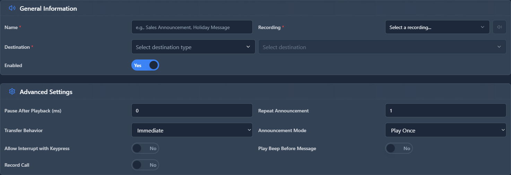

# Announcements

## 📖 Introduction

Announcements play an audio message to callers before routing them to a destination. This is useful for playing information, warnings, or greetings before connecting the call.

**Examples:**
- "Your call may be recorded for quality purposes..."
- "Our office hours are 9 AM to 5 PM..."
- "Please hold while we connect you..."

---

## 🎯 Common Use Cases

| Scenario | Announcement Content |
|----------|---------------------|
| Recording disclosure | "This call may be recorded..." |
| Business hours info | "We're open Monday-Friday..." |
| Queue intro | "Please hold for the next available agent" |
| Holiday message | "We are closed for the holiday..." |
| Promotional info | "Ask about our current specials!" |

---

## 🖥️ Accessing the Module

**Navigation:** `PBX → Applications → Announcements`

---

## 📝 Form Fields

| Field | Description | Example |
|-------|-------------|---------|
| **Name** | Internal identifier | `Recording Disclosure` |
| **Extension** | Optional direct extension number | `7001` |
| **Description** | Notes about this announcement | `Plays before support queue` |
| **Audio Type** | **Recording** = audio file, **TTS** = text-to-speech | `Recording` |
| **Audio File** | Audio file to play (if Recording) | `recording_notice.wav` |
| **TTS Text** | Text to speak (if TTS) | `Your call may be recorded...` |
| **Destination** | Where to route after playing | `Queue: Support` |
| **Wait for Digit** | Can caller press key to skip? | `No` |
| **Skip Digit** | Which key skips the announcement | `#` |
| **Enabled** | Turn on/off | `Yes` |

---

## 🚀 Practical Example: Recording Disclosure

### Scenario

Before calls reach the support queue, play: "This call may be recorded for training and quality purposes."

### Step 1: Create the Announcement

Go to **PBX → Applications → Announcements** and click **+ Add**.

### Step 2: Configure Settings

| Field | Value |
|-------|-------|
| Name | `Recording Disclosure` |
| Audio Type | `TTS` |
| TTS Text | `This call may be recorded for training and quality purposes.` |
| Destination | `Queue: Support` |
| Wait for Digit | `No` |

<!-- [IMG: example-announcement-config] -->

### Step 3: Update Inbound Route

Go to your inbound route and change the destination from the Queue to this Announcement.

**Flow becomes:** Inbound Call → Announcement → Support Queue

### Step 4: Test

Call in and verify you hear the message before reaching the queue.

---

## 💡 Tips & Best Practices

> [!TIP]
> **Keep it short**: Long announcements frustrate callers. Under 10 seconds is best.

> [!TIP]
> **Use for legal compliance**: Recording notices, consent messages, etc.

> [!TIP]
> **Chain announcements**: You can route one announcement to another for multiple messages.

> [!WARNING]
> **Test audio quality**: Poor quality audio reflects badly on your business.

---

## 🔗 Related Modules

- [IVRs](ivrs.md) — Interactive menus with announcements
- [Recording Management](../08-voicemail-audio/recording-management.md) — Upload audio files
- [Inbound Routes](../03-pbx-routing/inbound-routes.md) — Route incoming calls
- [Queues](../05-call-center/queues.md) — Call center with hold messages

---

*← Previous: [Ring Groups](ring-groups.md) | Next: [Conferences](conferences.md) →*
