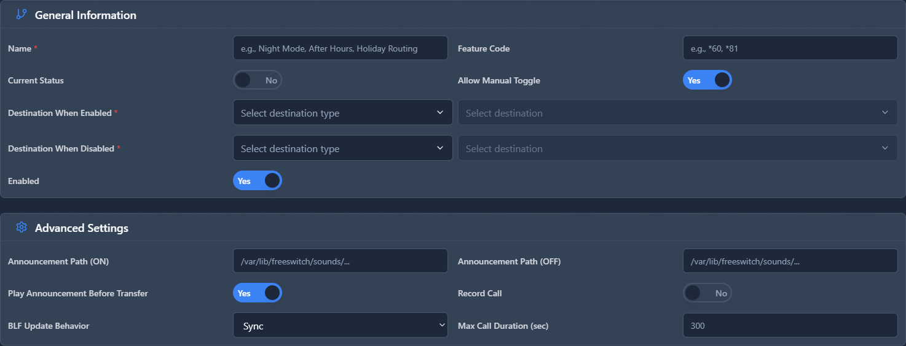

# Call Flows

## 📖 Introduction

Call Flows allow quick routing changes with a toggle. Create a Call Flow to switch between "Day Mode" and "Night Mode" with a phone dial code or button.

**Example:** Receptionist presses *28 to toggle after-hours mode without accessing the admin panel.

---

## 🎯 Common Use Cases

| Call Flow | Toggle Between |
|-----------|---------------|
| Open/Closed | IVR ↔ Closed Message |
| Holiday Mode | Normal ↔ Holiday Greeting |
| Forwarding | Office ↔ Cell Phone |
| Maintenance | Normal ↔ "System Down" Message |

---

## 🖥️ Accessing the Module

**Navigation:** `PBX → Incoming Tools → Call Flows`

---

## 📝 Form Fields

| Field | Description | Example |
|-------|-------------|---------|
| **Name** | Flow identifier | `After Hours Toggle` |
| **Feature Code** | Code to toggle | `*28` |
| **Current State** | Active destination | `Day Mode` |
| **Enabled** | Flow is active | `Yes` |

### State Destinations

| State | Destination |
|-------|-------------|
| **Day Mode** | Main IVR |
| **Night Mode** | After Hours Announcement |

---

## 🚀 Practical Example

### After Hours Toggle

1. Create Call Flow "After Hours"
2. Feature Code: `*28`
3. Day Mode: Route to `Main IVR`
4. Night Mode: Route to `Closed Announcement`

**Usage:**
- Receptionist dials `*28` at end of day
- System announces "Night mode activated"
- Calls now go to closed message
- Dial `*28` again in morning to toggle back

---

## 💡 Tips

> [!TIP]
> **BLF button**: Program phone button as call flow toggle.

> [!TIP]
> **Train staff**: Make sure they know the toggle code.

> [!WARNING]
> **Don't forget to toggle back**: Use Time Conditions for automatic switching.

---

## 🔗 Related Modules

- [Time Conditions](../03-pbx-routing/time-conditions.md) — Automatic time-based routing
- [Inbound Routes](../03-pbx-routing/inbound-routes.md) — Route destinations

---

*← Previous: [CID Modifiers](cid-modifiers.md) | Next: [Authentication Rules](authentication-rules.md) →*
