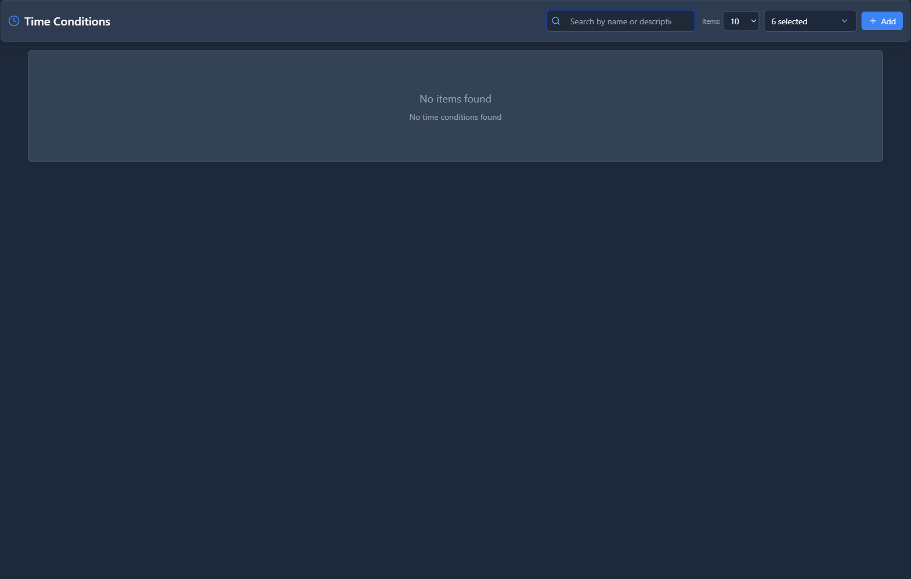

# Time Conditions

## 📖 Introduction

Time Conditions route calls differently based on the current time. Use them to send calls to different destinations during business hours vs after hours.

**Example:**
- 9 AM - 5 PM → Main IVR
- 5 PM - 9 AM → After-Hours Message + Voicemail
- Weekends → Closed Message

---

## 🎯 Common Use Cases

| Time Period | Routing |
|-------------|---------|
| Business hours | Normal routing (IVR, queues) |
| After hours | Voicemail or message |
| Holidays | Closed message |
| Lunch hour | Limited staff routing |
| Weekends | Emergency only |

---

## 🖥️ Accessing the Module

**Navigation:** `PBX → Routing → Time Conditions`



---

## 📝 Form Fields


| Field | Description | Example |
|-------|-------------|---------|
| **Name** | Condition identifier | `Business Hours` |
| **Extension** | Optional direct access | `8100` |
| **Time Group** | Schedule to check | `Office Hours` |
| **If Match** | Destination when time matches | `IVR: Main Menu` |
| **If No Match** | Destination when time doesn't match | `Announcement: After Hours` |
| **Enabled** | Condition is active | `Yes` |

---

## 🚀 Practical Example: Business Hours Routing

### Step 1: Create a Time Group

First, create a Time Group for your business hours (see Time Groups module).

**Office Hours Time Group:**
- Monday-Friday: 9:00 AM - 5:00 PM

### Step 2: Create the Time Condition

| Field | Value |
|-------|-------|
| Name | `Business Hours Check` |
| Time Group | `Office Hours` |
| If Match | `IVR: Main Menu` |
| If No Match | `Announcement: After Hours` |

<!-- [IMG: example-time-condition] -->

### Step 3: Update Inbound Route

Point your main inbound route to this Time Condition instead of directly to the IVR.

**Call Flow:**
```
Inbound Call
    ↓
Time Condition
    ↓
Is it 9-5 Mon-Fri?
    ↓
YES → Main IVR
NO  → After Hours Message
```

---

## 💡 Tips

> [!TIP]
> **Chain time conditions**: For complex schedules, route to another time condition.

> [!TIP]
> **Test before go-live**: Verify routing at different times of day.

---

## 🔗 Related Modules

- [Time Groups](time-groups.md) — Define the schedules
- [Inbound Routes](inbound-routes.md) — Route to time conditions
- [Announcements](../02-pbx-applications/announcements.md) — After-hours messages

---

*← Previous: [Outbound Routes](outbound-routes.md) | Next: [Time Groups](time-groups.md) →*
