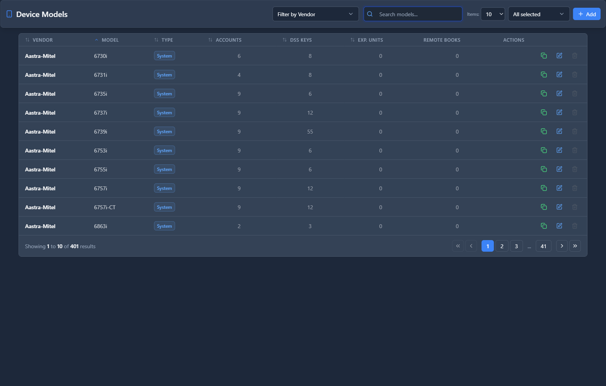

# Device Models

## 📖 Introduction

Device Models defines IP phone models for provisioning. Each model has specific configuration capabilities and templates.

---

## 🖥️ Accessing the Module

**Navigation:** `Settings → Provisioning → Device Models`

---

## 📝 Supported Models

| Brand | Models |
|-------|--------|
| **Yealink** | T46U, T48U, T54W, T58W, CP920 |
| **Polycom** | VVX150, VVX250, VVX350, VVX450 |
| **Grandstream** | GRP2612, GRP2614, GRP2616 |
| **Fanvil** | X3U, X4U, X5U, X6U |
| **Cisco** | SPA502, SPA504, SPA508 |

---

## 📝 Model Configuration

| Field | Description | Example |
|-------|-------------|---------|
| **Brand** | Manufacturer | `Yealink` |
| **Model** | Device model | `T54W` |
| **Lines** | Available lines | `10` |
| **BLF Keys** | Max BLF buttons | `27` |
| **Template** | Config template | `yealink-t5x.tpl` |
| **Firmware** | Latest firmware | `96.85.0.15` |

---

## 💡 Tips

> [!TIP]
> **Update firmware info**: Keep models current.

> [!TIP]
> **Know BLF limits**: Affects button assignments.

---

## 🔗 Related Modules

- [Provisioning Vendors](provisioning-vendors.md) — Brand settings
- [Provisioning Devices](provisioning-devices.md) — Device inventory
