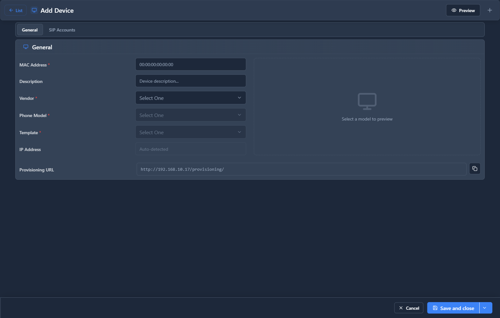

# Provisioning Devices

## 📖 Introduction

Provisioning Devices is the inventory of all IP phones in the system. Track devices by MAC address and manage their configuration.

---

## 🖥️ Accessing the Module

**Navigation:** `Settings → Provisioning → Devices`

---

## 📝 Device List

| Column | Description |
|--------|-------------|
| **MAC** | Device MAC address |
| **Model** | Phone model |
| **Extension** | Assigned extension |
| **Template** | Config template |
| **Last Seen** | Last provision check |
| **Status** | Online/Offline |

---

## 📝 Device Form

| Field | Description | Example |
|-------|-------------|---------|
| **MAC Address** | Device MAC | `00:15:65:XX:XX:XX` |
| **Model** | Phone model | `Yealink T54W` |
| **Extension** | Assigned ext | `1001` |
| **Template** | Config template | `Standard Desk` |
| **Description** | Notes | `John's desk phone` |

---

## 🔄 Device Actions

| Action | Purpose |
|--------|---------|
| **Provision** | Push config now |
| **Reboot** | Restart phone |
| **Factory Reset** | Clear config |
| **Delete** | Remove from inventory |

---

## 💡 Tips

> [!TIP]
> **Use DHCP Option 66**: Auto-discover provisioning.

> [!TIP]
> **Track by location**: Add notes for where devices are.

---

## 🔗 Related Modules

- [Device Models](device-models.md) — Phone models
- [Provisioning Templates](provisioning-templates.md) — Config templates
- [Extensions](../01-pbx-extensions/extensions.md) — Extension assignment
