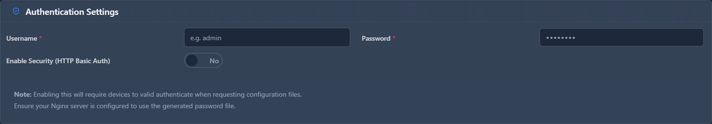

# Provisioning Security

## 📖 Introduction

Provisioning Security configures authentication for phone provisioning. Protect configuration files from unauthorized access.

---

## ⚠️ Why This Matters

> [!WARNING]
> **Unprotected provisioning**: Exposes SIP passwords and settings.

---

## 🖥️ Accessing the Module

**Navigation:** `Settings → Provisioning → Security`

---

## 📝 Security Options

| Field | Description | Example |
|-------|-------------|---------|
| **HTTP Auth** | Require authentication | `Yes` |
| **Auth Type** | Basic or Digest | `Digest` |
| **HTTPS Only** | Require encrypted | `Yes` |
| **MAC Verification** | Verify MAC address | `Yes` |
| **IP Whitelist** | Only allow listed IPs | `No` |

### Authentication Methods

| Method | Security Level |
|--------|---------------|
| None | 🔴 No security |
| Basic | 🟡 Encoded, not encrypted |
| Digest | 🟢 Secure |
| Client Cert | 🟢 Most secure |

---

## 💡 Tips

> [!TIP]
> **Use HTTPS + Digest**: Good balance of security.

> [!TIP]
> **Enable MAC verification**: Prevents unauthorized access.

> [!CAUTION]
> **Never use "None"**: Always require authentication.

---

## 🔗 Related Modules

- [Provisioning Vendors](provisioning-vendors.md) — Vendor settings
- [Certificates](../18-system/certificates.md) — HTTPS certificates
