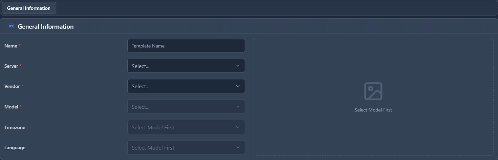

# Provisioning Templates

## 📖 Introduction

Provisioning Templates define phone configurations — BLF buttons, features, and settings. Apply templates to devices for consistent setup.

---

## 🎯 Common Templates

| Template | Use Case |
|----------|----------|
| Standard Desk | Regular employee |
| Reception | Many BLF buttons |
| Executive | All features, sidecar |
| Conference Room | Auto-answer, no voicemail |
| Lobby | Restricted dialing |

---

## 🖥️ Accessing the Module

**Navigation:** `Settings → Provisioning → Templates`

---

## 📝 Form Fields

### General

| Field | Description | Example |
|-------|-------------|---------|
| **Name** | Template name | `Sales Desk` |
| **Model** | Target model | `Yealink T54W` |
| **Description** | Purpose | `Sales team phones` |

### Features

| Feature | Description |
|---------|-------------|
| **Voicemail Button** | Quick voicemail access |
| **Do Not Disturb** | DND toggle |
| **Call Forwarding** | Forward buttons |
| **Intercom** | Intercom button |

### BLF Buttons

| Position | Type | Value |
|----------|------|-------|
| 1 | BLF | `1001` |
| 2 | BLF | `1002` |
| 3 | Speed Dial | `18005551234` |
| 4 | Park | `701` |

---

## 💡 Tips

> [!TIP]
> **Create per role**: Different roles need different buttons.

> [!TIP]
> **Test before rollout**: Verify template works.

---

## 🔗 Related Modules

- [Provisioning Devices](provisioning-devices.md) — Apply templates
- [Device Models](device-models.md) — Model capabilities
