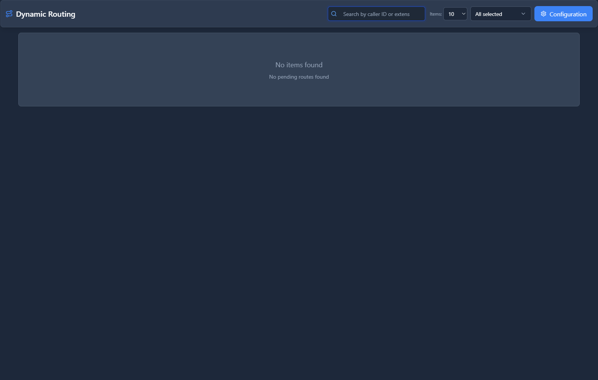

# Dynamic Routing

## 📖 Introduction

Dynamic Routing automatically routes calls based on real-time database lookups. The system checks the caller ID against a list and routes accordingly.

**Use case:** Route repeat callers to their assigned representative.

---

## 🎯 Common Use Cases

| Scenario | Dynamic Route |
|----------|---------------|
| Return customer | Route to assigned rep |
| Missed call callback | Track pending returns |
| VIP detection | Route to priority queue |
| Geographic routing | Route by area code |

---

## 🖥️ Accessing the Module

**Navigation:** `PBX → Incoming Tools → Dynamic Routing`

---

## 📝 Form Fields

### Configuration

| Field | Description | Example |
|-------|-------------|---------|
| **Name** | Rule name | `Customer Routing` |
| **Source** | Inbound route/queue | `Main Number` |
| **Digits Match** | Digits to extract | `10` |
| **Match Destination** | Where to route matches | `Extension (Dynamic)` |
| **No Match Destination** | Where if no match | `IVR: Main Menu` |
| **Delete After Use** | Remove record after callback | `No` |
| **Enabled** | Rule is active | `Yes` |

### Routes Database

| Caller ID | Destination | Notes |
|-----------|-------------|-------|
| `+15551111111` | `Ext 1001` | Acme account |
| `+15552222222` | `Ext 1002` | Widget Inc |

---

## 🚀 Practical Example

### Route Repeat Callers to Assigned Rep

When a known customer calls, route them directly to their assigned sales rep instead of the main IVR.

| Caller | Assigned Rep |
|--------|--------------|
| +1-555-111-1111 | John (1001) |
| +1-555-222-2222 | Jane (1002) |

---

## 💡 Tips

> [!TIP]
> **Integrate with CRM**: Automatically add customers to routing table.

> [!TIP]
> **Set fallback**: Unknown callers still need a destination.

---

## 🔗 Related Modules

- [Inbound Routes](../03-pbx-routing/inbound-routes.md) — Static routing
- [VIP Lists](../05-call-center/vip-lists.md) — Priority callers

---

*← Previous: [Blacklist](blacklist.md) | Next: [Caller ID Lookup](caller-id-lookup.md) →*
