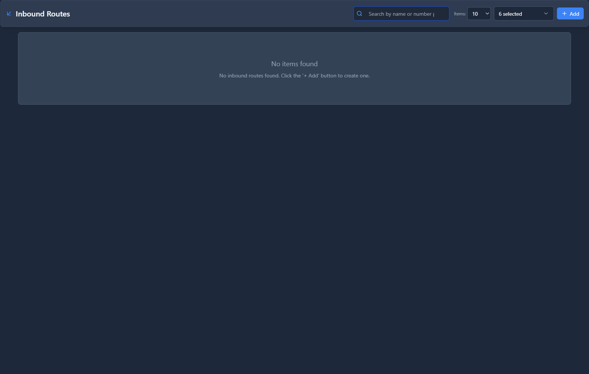

# Inbound Routes

## 📖 Introduction

Inbound Routes determine where incoming calls go based on the number that was dialed (DID). When someone calls your phone number, the inbound route decides which destination answers.

**Example:** 
- Calls to +1-555-123-4567 → Main IVR
- Calls to +1-555-123-4568 → Support Queue
- Calls to +1-555-123-4569 → Extension 1001 (Direct Line)

---

## 🎯 Common Use Cases

| DID Number | Destination |
|------------|-------------|
| Main line | IVR/Auto-Attendant |
| Support line | Support Queue |
| Sales line | Sales Ring Group |
| Executive direct line | Extension |
| Fax line | Fax Device |

---

## 🖥️ Accessing the Module

**Navigation:** `PBX → Routing → Inbound Routes`

---

## 📝 Form Fields

| Field | Description | Example |
|-------|-------------|---------|
| **Name** | Route identifier | `Main Number Route` |
| **DID Pattern** | Number pattern to match | `+15551234567` |
| **CID Pattern** | Caller ID pattern (optional) | `(empty = all)` |
| **Destination Type** | Where to send the call | `IVR` |
| **Destination** | Specific destination | `Main Menu` |
| **Priority** | Route order (lower = first) | `1` |
| **Enabled** | Route is active | `Yes` |

### DID Pattern Examples

| Pattern | Matches |
|---------|---------|
| `+15551234567` | Exact number only |
| `+1555*` | Any number starting with +1555 |
| `*` | All numbers (catch-all) |

---

## 🚀 Practical Example: Main Number to IVR

### Scenario

Route your main company number to the main IVR menu.

### Step 1: Create the Inbound Route

| Field | Value |
|-------|-------|
| Name | `Main Number` |
| DID Pattern | `+15551234567` |
| Destination Type | `IVR` |
| Destination | `Main Menu` |
| Priority | `1` |

<!-- [IMG: example-inbound-route] -->

### Step 2: Test

Call your main number and verify the IVR answers.

---

## 💡 Tips & Best Practices

> [!TIP]
> **Create a catch-all route**: A `*` pattern route handles unknown DIDs.

> [!TIP]
> **Use priorities**: More specific routes should have lower priority numbers.

> [!TIP]
> **Document your DIDs**: Keep a spreadsheet of all DIDs and their purposes.

---

## 🔗 Related Modules

- [Gateways](gateways.md) — Where calls come from
- [IVRs](../02-pbx-applications/ivrs.md) — Common destination
- [Time Conditions](time-conditions.md) — Route differently by time

---

*← Previous: [Gateways](gateways.md) | Next: [Outbound Routes](outbound-routes.md) →*
