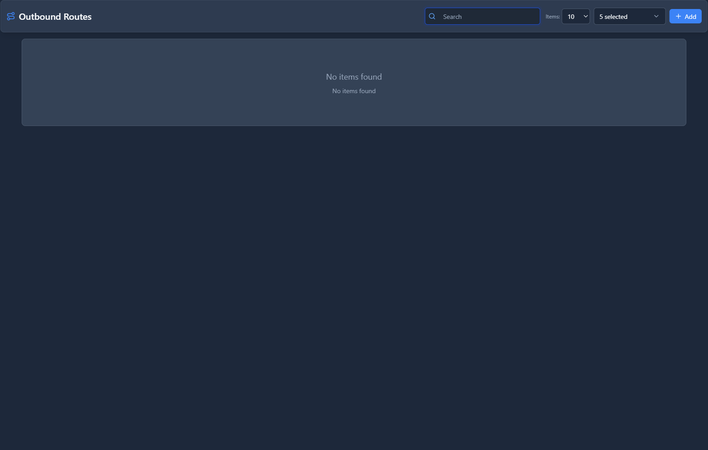
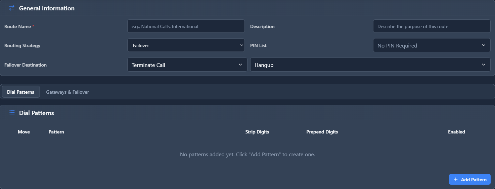

# Outbound Routes

## 📖 Introduction

Outbound Routes determine which gateway to use when users dial external numbers. Routes match dial patterns and send calls through the appropriate trunk.

**Example:**
- Local calls (7 digits) → Local carrier
- Long distance (1+10 digits) → Primary VoIP provider
- International (011+) → International carrier
- Emergency (911) → Primary trunk with priority

---

## 🎯 Common Use Cases

| Call Type | Route To |
|-----------|----------|
| Local calls | Local carrier (cheapest) |
| Long distance | VoIP provider |
| International | Specialized intl carrier |
| Emergency (911) | Primary trunk (highest priority) |
| Toll-free (1-800) | Free via any trunk |

---

## 🖥️ Accessing the Module

**Navigation:** `PBX → Routing → Outbound Routes`

---

## 📝 Form Fields

| Field | Description | Example |
|-------|-------------|---------|
| **Name** | Route identifier | `Long Distance` |
| **Dial Pattern** | Numbers this route handles | `1NXXNXXXXXX` |
| **Strip Digits** | Digits to remove before dialing | `0` |
| **Prepend** | Digits to add before dialing | `+1` |
| **Priority** | Route order | `5` |
| **Gateway** | Trunk to use | `Twilio Production` |
| **Failover Gateway** | Backup trunk | `Telnyx Backup` |
| **Enabled** | Route is active | `Yes` |

### Dial Pattern Reference

| Pattern | Meaning | Matches |
|---------|---------|---------|
| `X` | Any digit 0-9 | `5`, `9`, etc. |
| `N` | Any digit 2-9 | `2`, `7`, etc. |
| `Z` | Any digit 1-9 | `1`, `5`, etc. |
| `.` | One or more of anything | Everything else |
| `[123]` | Any listed digit | `1`, `2`, or `3` |

### Common Patterns

| Pattern | Description |
|---------|-------------|
| `NXXNXXXXXX` | 10-digit US local |
| `1NXXNXXXXXX` | 11-digit US long distance |
| `011.` | International |
| `911` | Emergency |
| `1800NXXXXXX` | Toll-free |

---

## 🚀 Practical Example: US Dial Plan

### Create Routes for US Calling

**Route 1: Emergency (911)**
| Field | Value |
|-------|-------|
| Name | `Emergency 911` |
| Pattern | `911` |
| Priority | `1` |
| Gateway | `Primary Trunk` |

**Route 2: Local Calls**
| Field | Value |
|-------|-------|
| Name | `Local 10-digit` |
| Pattern | `NXXNXXXXXX` |
| Prepend | `+1` |
| Priority | `5` |
| Gateway | `Primary Trunk` |

**Route 3: Long Distance**
| Field | Value |
|-------|-------|
| Name | `Long Distance` |
| Pattern | `1NXXNXXXXXX` |
| Prepend | `+` |
| Priority | `10` |
| Gateway | `Primary Trunk` |

<!-- [IMG: example-outbound-routes] -->

---

## 💡 Tips & Best Practices

> [!TIP]
> **Emergency routes first**: Always give 911 the highest priority (lowest number).

> [!TIP]
> **Set up failover**: If your primary trunk goes down, calls automatically use backup.

> [!TIP]
> **Test with real calls**: Verify routes work before going live.

> [!WARNING]
> **Emergency routing is critical**: Test 911 routing regularly (with your local PSAP's permission).

---

## 🔗 Related Modules

- [Gateways](gateways.md) — Trunks used by routes
- [Class of Services](../04-class-of-service/class-of-services.md) — Restrict user access to routes

---

*← Previous: [Inbound Routes](inbound-routes.md) | Next: [Time Conditions](time-conditions.md) →*
