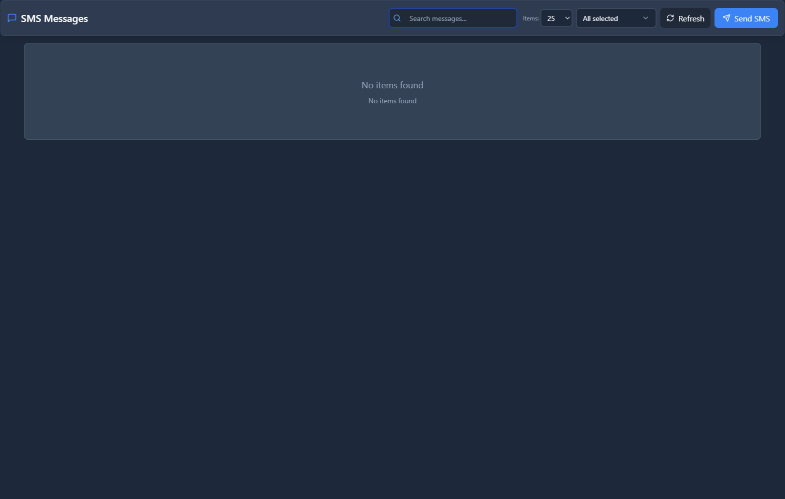

# SMS Messages

## 📖 Introduction

SMS Messages shows the history of all sent and received text messages. View delivery status, search conversations, and export data.

---

## 🖥️ Accessing the Module

**Navigation:** `SMS → Messages`

---

## 📝 Message List

| Column | Description |
|--------|-------------|
| **Date** | Message timestamp |
| **From** | Sender number |
| **To** | Recipient number |
| **Message** | Text content |
| **Status** | Sent/Delivered/Failed |
| **Extension** | Assigned user |

### Status Types

| Status | Meaning |
|--------|---------|
| 🟢 Delivered | Confirmed receipt |
| 🟡 Sent | In transit |
| 🔴 Failed | Delivery error |
| ⚪ Pending | Queued |

---

## 🔍 Filtering

| Filter | Options |
|--------|---------|
| Date Range | Start/End dates |
| Number | Specific phone |
| Extension | Specific user |
| Status | Delivered/Failed |
| Direction | Inbound/Outbound |

---

## 💡 Tips

> [!TIP]
> **Export for compliance**: Download message logs.

> [!TIP]
> **Filter by failed**: Address delivery issues.

---

## 🔗 Related Modules

- [SMS Conversations](../07-communications/sms-conversations.md) — Threaded view
- [SMS Opt-outs](sms-optouts.md) — Unsubscribed numbers
