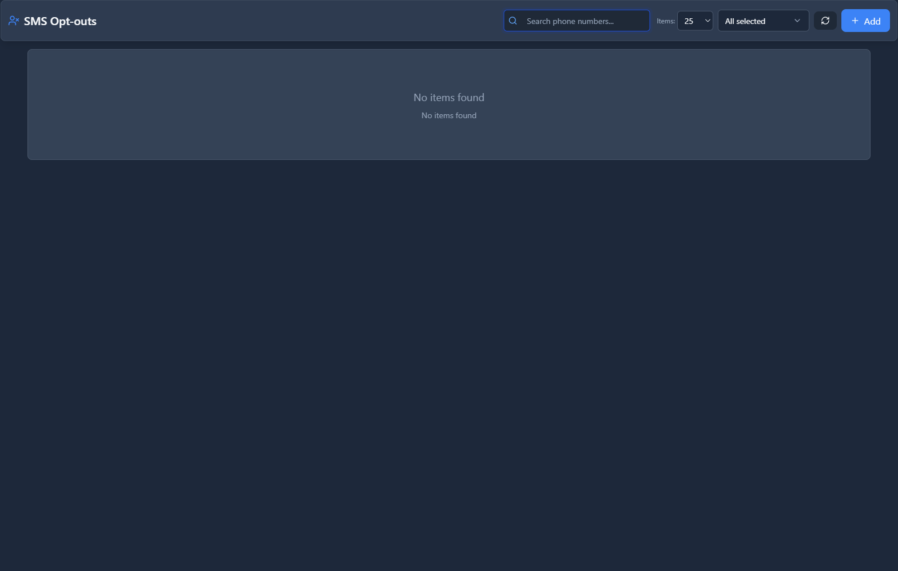

# SMS Opt-outs

## 📖 Introduction

SMS Opt-outs tracks numbers that have unsubscribed from SMS. Essential for compliance with messaging regulations (TCPA, GDPR).

---

## ⚠️ Compliance Critical

> [!CAUTION]
> **Never message opt-outs**: Legal penalties for non-compliance.

---

## 🖥️ Accessing the Module

**Navigation:** `SMS → Opt-outs`

---

## 📝 Opt-out List

| Column | Description |
|--------|-------------|
| **Number** | Unsubscribed phone |
| **Date** | When opted out |
| **Method** | How (STOP, web, etc.) |
| **Reason** | Optional notes |

---

## 🔄 How Opt-outs Work

1. User texts **STOP** to your number
2. System adds to opt-out list
3. Future messages blocked
4. User can text **START** to resubscribe

### Keywords

| Keyword | Action |
|---------|--------|
| STOP | Unsubscribe |
| UNSUBSCRIBE | Unsubscribe |
| START | Resubscribe |
| SUBSCRIBE | Resubscribe |

---

## 📝 Manual Management

| Action | Purpose |
|--------|---------|
| **Add** | Manually add opt-out |
| **Remove** | Remove if user resubscribes |
| **Import** | Bulk add from CSV |
| **Export** | Download list |

---

## 💡 Tips

> [!TIP]
> **Review regularly**: Clean up old opt-outs.

> [!TIP]
> **Document consent**: Track how users opt-in.

> [!CAUTION]
> **Check before campaigns**: Always filter opt-outs.

---

## 🔗 Related Modules

- [SMS Messages](sms-messages.md) — Message history
- [SMS Settings](sms-settings.md) — Compliance settings
