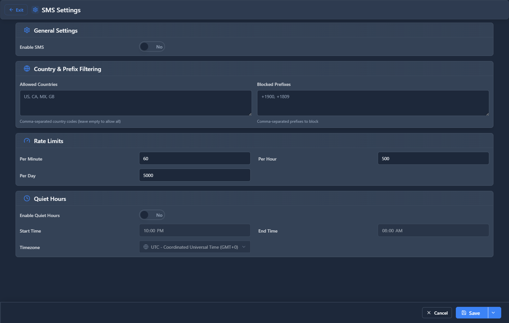

# SMS Settings

## 📖 Introduction

SMS Settings configures system-wide SMS behavior including opt-out keywords, auto-replies, and compliance settings.

---

## 🖥️ Accessing the Module

**Navigation:** `SMS → Settings`

---

## 📝 Form Fields

### General Settings

| Field | Description | Example |
|-------|-------------|---------|
| **SMS Enabled** | Enable SMS system | `Yes` |
| **Default Provider** | Fallback provider | `Twilio` |
| **Max Length** | Character limit | `160` |
| **Concatenate** | Join long messages | `Yes` |

### Compliance Settings

| Field | Description | Example |
|-------|-------------|---------|
| **Honor Opt-outs** | Block opted-out numbers | `Yes` |
| **Auto STOP Reply** | Confirm unsubscribe | `Yes` |
| **STOP Message** | Confirmation text | `You've been unsubscribed` |
| **Quiet Hours** | No messages after | `9 PM - 8 AM` |

### Auto-Replies

| Field | Description | Example |
|-------|-------------|---------|
| **After Hours** | When office closed | `We're closed. Call back at...` |
| **No Agent** | When no one available | `We'll respond shortly` |

---

## 💡 Tips

> [!TIP]
> **Enable quiet hours**: Avoid late-night messages.

> [!TIP]
> **Always honor opt-outs**: Required by law.

---

## 🔗 Related Modules

- [SMS Providers](sms-providers.md) — Provider config
- [SMS Opt-outs](sms-optouts.md) — Unsubscribe list
