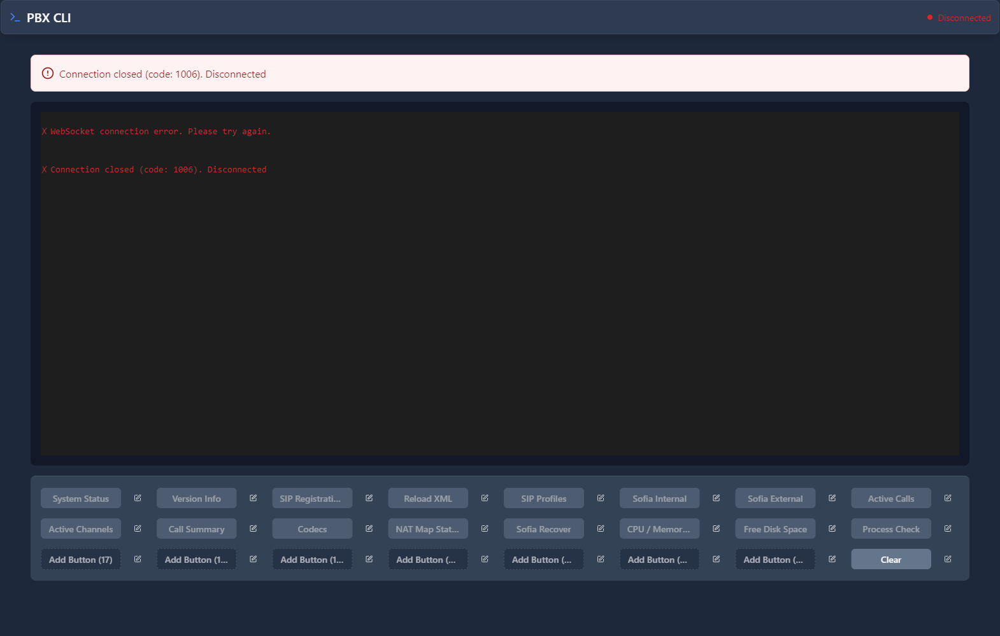

# PBX CLI

## 📖 Introduction

PBX CLI provides direct access to the FreeSWITCH command line interface. Use for advanced troubleshooting and real-time system commands.

---

## ⚠️ Advanced Feature

> [!WARNING]
> **For advanced users only**: Incorrect commands can affect call processing.

---

## 🖥️ Accessing the Module

**Navigation:** `PBX → Tools → PBX CLI`



---

## 📝 Common Commands

### Status Commands

| Command | Purpose |
|---------|---------|
| `show channels` | List active calls |
| `show registrations` | List registered phones |
| `status` | System status |
| `sofia status` | SIP profile status |

### Call Commands

| Command | Purpose |
|---------|---------|
| `uuid_kill <uuid>` | Hangup a call |
| `uuid_transfer <uuid> <ext>` | Transfer call |
| `uuid_record <uuid> start` | Start recording |

### Debug Commands

| Command | Purpose |
|---------|---------|
| `sofia loglevel all 9` | Enable SIP debug |
| `console loglevel debug` | Console debug |
| `reloadxml` | Reload config |

---

## 🚀 Practical Example

### Debug Registration Issue

```
sofia status profile internal
show registrations
sofia loglevel all 9
```

This shows SIP profile status, registered devices, and enables SIP logging.

---

## 💡 Tips

> [!TIP]
> **Use show commands first**: Read-only, safe to run.

> [!TIP]
> **Turn off debug when done**: Debug logging uses resources.

> [!CAUTION]
> **uuid_kill ends calls**: Be careful with call manipulation.

---

## 🔗 Related Modules

- [Log File Viewer](log-file-viewer.md) — View logs
- [System Status](../11-administration/system-status.md) — Health overview
