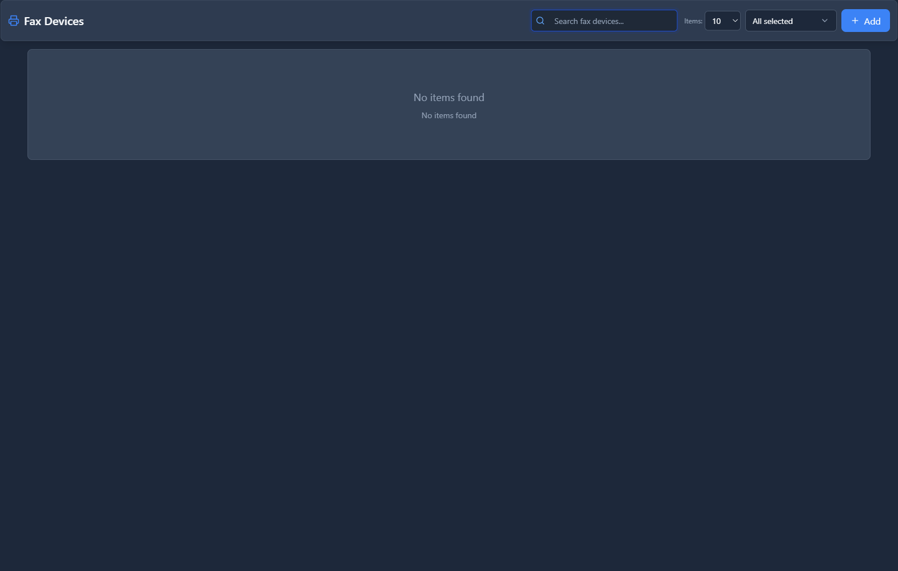
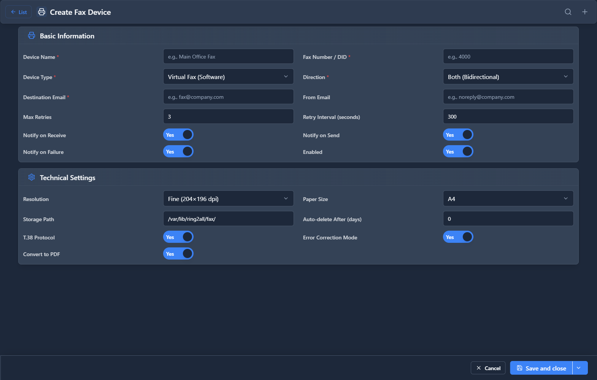

# Fax Devices

## 📖 Introduction

Fax Devices configure virtual fax lines that can send and receive faxes. Each device is assigned a phone number and receives faxes as PDFs via email.

---

## 🎯 Common Use Cases

| Use Case | Configuration |
|----------|---------------|
| Inbound fax to email | Auto-forward to staff |
| Legal documents | Compliance requirement |
| Vendor communication | Some vendors still fax orders |
| Healthcare | HIPAA-compliant document exchange |

---

## 🖥️ Accessing the Module

**Navigation:** `PBX → Fax → Fax Devices`

---

## 📝 Form Fields

| Field | Description | Example |
|-------|-------------|---------|
| **Name** | Fax device name | `Main Fax` |
| **Extension** | Fax line extension | `3001` |
| **Email** | Where to send received faxes | `fax@company.com` |
| **Caller ID** | Outbound fax caller ID | `+15559999999` |
| **Description** | Notes | `General fax inbox` |
| **Enabled** | Device is active | `Yes` |

---

## 🚀 Practical Example

### Create Company Fax Line

| Field | Value |
|-------|-------|
| Name | `Main Fax` |
| Extension | `3001` |
| Email | `admin@company.com` |
| Caller ID | `+15559999999` |

- Incoming faxes to 3001 are sent as PDFs to admin@company.com
- Staff can send faxes through the Fax Sending module

---

## 💡 Tips

> [!TIP]
> **Dedicated fax number**: Keep fax separate from voice lines.

> [!TIP]
> **Multiple inboxes**: Create devices for different departments.

---

## 🔗 Related Modules

- [Fax Sending](fax-sending.md) — Send outbound faxes
- [Fax Viewer](fax-viewer.md) — View fax history

---

*← Previous: [SMS Conversations](sms-conversations.md) | Next: [Fax Sending](fax-sending.md) →*
