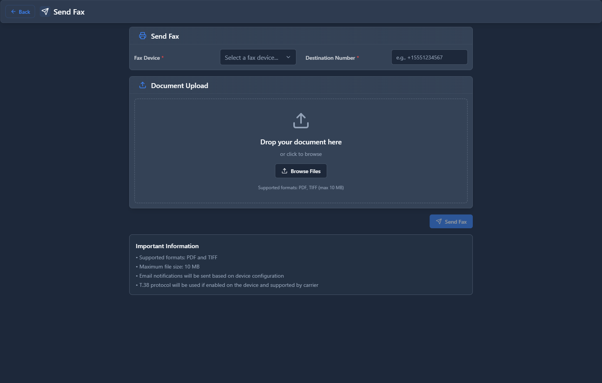

# Fax Sending

## 📖 Introduction

Fax Sending allows you to send faxes from the web interface. Upload a PDF, enter the destination number, and the system sends it as a fax.

---

## 🖥️ Accessing the Module

**Navigation:** `PBX → Fax → Fax Sending`

---

## 📝 Send a Fax

<!-- [IMG: fax-sending-form] -->

### Step 1: Select Fax Device

Choose which fax device (and associated caller ID) to use.

### Step 2: Enter Destination

| Field | Description | Example |
|-------|-------------|---------|
| **To Number** | Fax number to send to | `+15551234567` |
| **Cover Page** | Include cover page | `Yes` |
| **Subject** | Cover page subject | `Contract for Review` |
| **Notes** | Cover page notes | `Please sign and return` |

### Step 3: Upload Document

Upload a PDF file to send.

### Step 4: Send

Click **Send Fax** to start transmission.

---

## 🚀 Practical Example

### Send Contract to Client

| Field | Value |
|-------|-------|
| Device | `Main Fax` |
| To | `+15559876543` |
| Cover Page | `Yes` |
| Subject | `Contract Agreement` |
| Document | `contract.pdf` |

---

## 💡 Tips

> [!TIP]
> **Use PDF format**: Most compatible for fax conversion.

> [!TIP]
> **Check fax viewer**: Verify transmission was successful.

---

## 🔗 Related Modules

- [Fax Devices](fax-devices.md) — Configure fax lines
- [Fax Viewer](fax-viewer.md) — View sent fax history

---

*← Previous: [Fax Devices](fax-devices.md) | Next: [Fax Viewer](fax-viewer.md) →*
