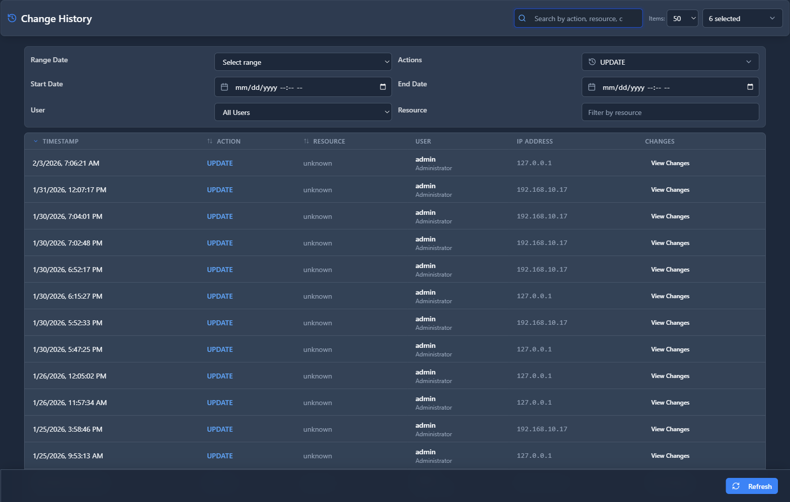

# Change History

## 📖 Introduction

Change History tracks all configuration changes made in the system. View detailed before/after comparisons and rollback changes if needed.

---

## 🎯 Key Features

| Feature | Description |
|---------|-------------|
| Version Tracking | All config versions |
| Diff View | Before/after comparison |
| Rollback | Restore previous state |
| Attribution | Who made changes |

---

## 🖥️ Accessing the Module

**Navigation:** `Reports → System Reports → Change History`

---

## 📊 History Fields

| Field | Description | Example |
|-------|-------------|---------|
| **Timestamp** | When changed | `2024-01-15 14:30` |
| **User** | Who made change | `admin@example.com` |
| **Module** | Affected module | `Extensions` |
| **Item** | Specific item | `Extension 101` |
| **Field** | Changed field | `Forward Number` |
| **Old Value** | Previous value | `None` |
| **New Value** | Current value | `102` |

---

## ⚡ Actions

| Action | Description |
|--------|-------------|
| **View Diff** | Side-by-side comparison |
| **Rollback** | Restore previous value |
| **Export** | Download change log |

---

## 💡 Tips

> [!TIP]
> **Review before rollback**: Verify changes to avoid breaking configs.

> [!WARNING]
> **Rollback carefully**: Some changes affect dependent settings.

---

## 🔗 Related Modules

- [Audit Logs](audit-logs.md) — All user actions
- [User Activity](user-activity.md) — Session tracking
