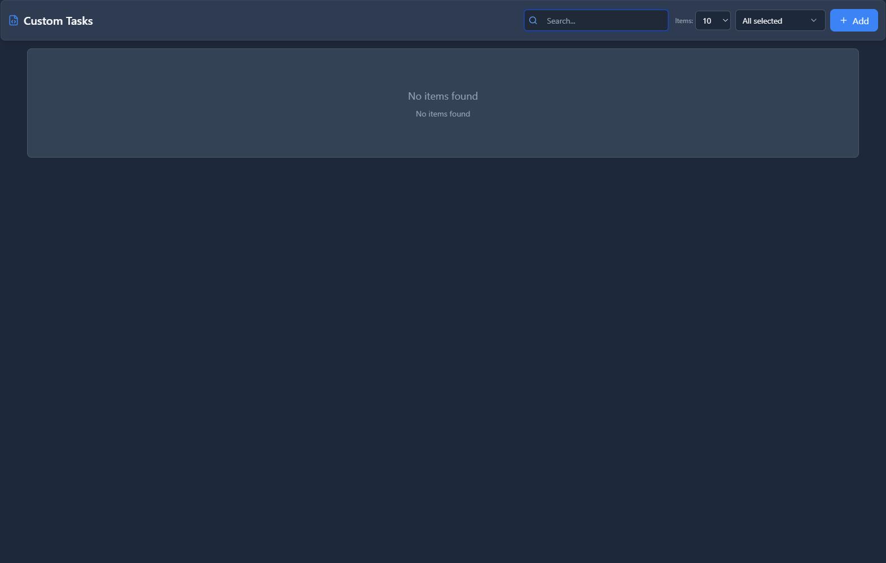
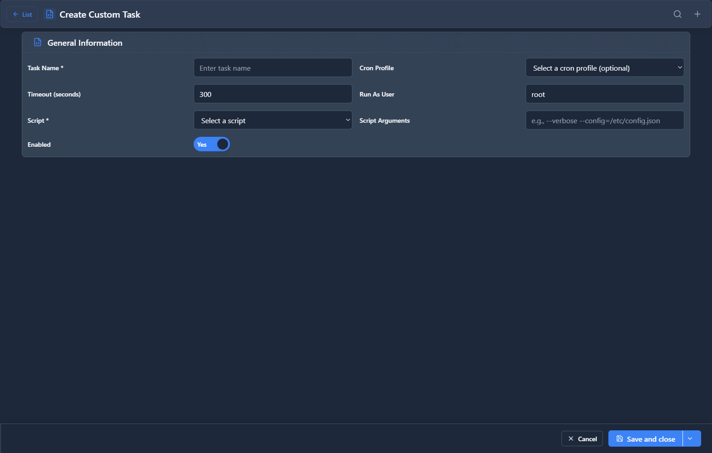

# Custom Tasks

## 📖 Introduction

Custom Tasks schedules script execution. Run maintenance scripts, integration tasks, or custom automation.

---

## ⚠️ Advanced Feature

> [!WARNING]
> **For administrators only**: Scripts run with system privileges.

---

## 🖥️ Accessing the Module

**Navigation:** `Admin → Maintenance → Custom Tasks`

---

## 📝 Form Fields

| Field | Description | Example |
|-------|-------------|---------|
| **Name** | Task name | `Sync CRM` |
| **Script** | Script path | `/opt/scripts/sync.sh` |
| **Schedule** | Cron expression | `0 */4 * * *` |
| **Timeout** | Max runtime (sec) | `300` |
| **Enabled** | Task is active | `Yes` |

---

## 📊 Execution Log

| Column | Description |
|--------|-------------|
| **Run Time** | When executed |
| **Duration** | How long |
| **Status** | Success/Failed |
| **Output** | Script output |

---

## 💡 Tips

> [!TIP]
> **Set timeouts**: Prevent runaway scripts.

> [!TIP]
> **Log output**: Check execution logs for issues.

> [!CAUTION]
> **Test manually first**: Verify script before scheduling.

---

## 🔗 Related Modules

- [Cron Profiles](cron-profiles.md) — Scheduling
- [System Cleanup](system-cleanup.md) — Built-in tasks
