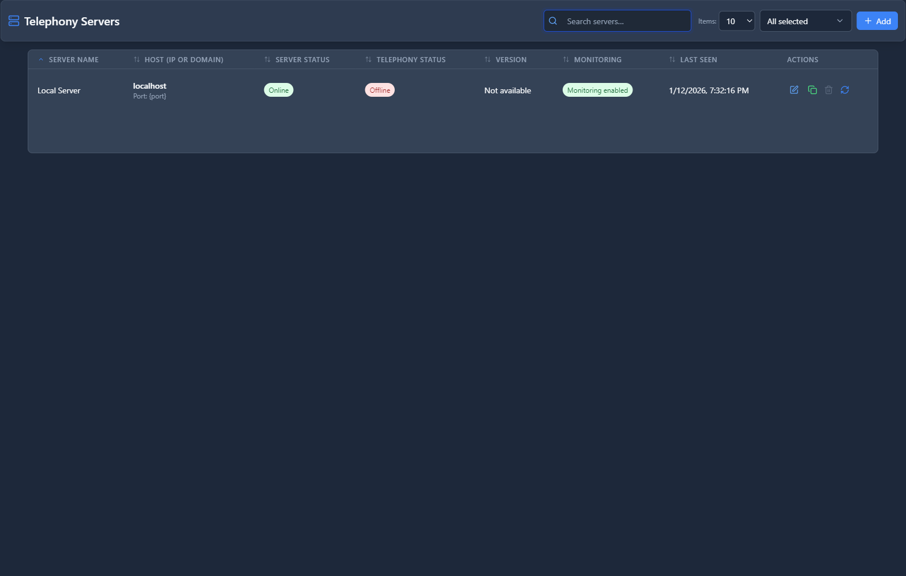

# Telephony Servers

## 📖 Introduction

Telephony Servers manages FreeSWITCH server instances. View status, restart services, and configure in distributed deployments.

---

## 🖥️ Accessing the Module

**Navigation:** `Admin → System → Telephony Servers`

---

## 📝 Server List

| Column | Description |
|--------|-------------|
| **Name** | Server identifier |
| **Host** | IP address |
| **Status** | Running/Stopped |
| **Uptime** | Time since start |
| **Active Calls** | Current calls |
| **CPU/Memory** | Resource usage |

---

## 📝 Server Actions

| Action | Purpose |
|--------|---------|
| **Reload** | Reload XML config |
| **Restart** | Restart FreeSWITCH |
| **Stop** | Stop server |
| **Start** | Start server |
| **Console** | Open CLI |

---

## 📊 Server Details

| Info | Description |
|------|-------------|
| **Version** | FreeSWITCH version |
| **Profile** | SIP profile status |
| **Modules** | Loaded modules |
| **Channels** | Active channels |

---

## 💡 Tips

> [!TIP]
> **Reload vs Restart**: Reload is faster, restart is complete.

> [!TIP]
> **Monitor resources**: High CPU may indicate issues.

> [!WARNING]
> **Restart affects calls**: Active calls will drop.

---

## 🔗 Related Modules

- [System Status](../11-administration/system-status.md) — System health
- [PBX CLI](../13-pbx-tools/pbx-cli.md) — Console access
