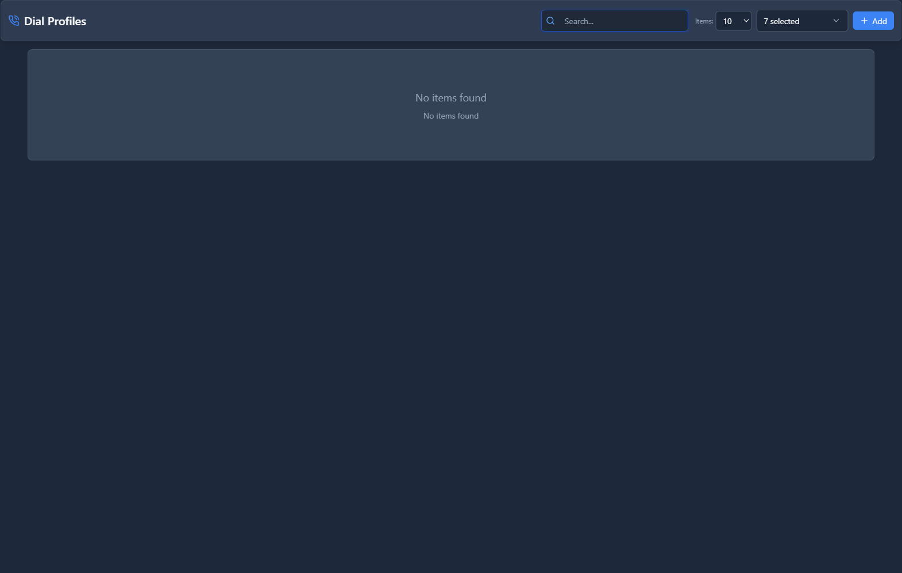

# Dial Profiles

## 📖 Introduction

Dial Profiles define dialing behavior templates including digit manipulation, timeout settings, and dial patterns. These profiles control how calls are initiated and processed.

---

## 🎯 Key Features

| Feature | Description |
|---------|-------------|
| Digit Manipulation | Add/strip digits |
| Timeouts | Dial/ring timeouts |
| Patterns | Dial pattern matching |
| Caller ID | CID rules |
| Options | Call options |

---

## 🖥️ Accessing the Module

**Navigation:** `Settings → Technology Settings → Dial Profiles`

---

## 📝 Form Fields

### General Settings

| Field | Description | Example |
|-------|-------------|---------|
| **Profile Name** | Unique identifier | `internal-dial` |
| **Description** | Profile description | `Internal extensions` |
| **Enabled** | Active status | `Yes` |

### Digit Manipulation

| Field | Description | Example |
|-------|-------------|---------|
| **Strip Digits** | Digits to remove | `1` |
| **Prepend Digits** | Digits to add | `9` |
| **Match Pattern** | Digit pattern | `^1[0-9]{10}$` |

### Timeout Settings

| Field | Description | Default |
|-------|-------------|---------|
| **Dial Timeout** | Max dial time | `30 seconds` |
| **Ring Timeout** | Max ring time | `60 seconds` |
| **No Answer Timeout** | Before action | `45 seconds` |

### Call Options

| Field | Description | Default |
|-------|-------------|---------|
| **Ringback** | Play ringback tone | `Yes` |
| **Early Media** | Allow early media | `Yes` |
| **Progress Indication** | Send progress | `Yes` |

### Caller ID Settings

| Field | Description | Example |
|-------|-------------|---------|
| **Force Caller ID** | Override CID | `No` |
| **Caller ID Number** | Fixed CID number | `5551234567` |
| **Caller ID Name** | Fixed CID name | `Main Office` |

---

## 💡 Tips

> [!TIP]
> **Use patterns for routing**: Match specific number formats for different routes.

> [!TIP]
> **Set appropriate timeouts**: Balance user experience with system resources.

---

## 🔗 Related Modules

- [Outbound Routes](../../pbx/routing/outbound-routes.md) — Route configuration
- [Device Profiles](device-profiles.md) — Device settings
- [Gateway Profiles](gateway-profiles.md) — Trunk settings
